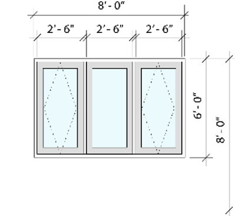

# Automatic Dimension Support

By [Josh Loy](mailto:jloy@nemetschek.net)

## Automatic Dimension Support

Graphic Legends have provisions for automatic dimensioning, which is especially useful for doors and windows but can be included with almost any plug-in object.

The different types of auto-dimensions are identified by a universal name. Vectorworks provides some predefined types in the following string file:  
`Vectorworks/Strings/AutoDimensionIdentifiers.vwstrings`

Developers can implement some, none, or all of the predefined types or provide their own custom types. Auto-dimensions may be restricted to be visible in certain views or orientations, and they may also be stacked.



To support auto-dimensioning, your plug-in should implement the following event sync functions:

- **`OnAutoDimMessage_GetLocalizedTypeName`**: Has the universal name as the input parameter, and the developer will output the translated long name/description. Most of the time, you would just look for the universal name in the `vwstrings` file above and return the long string.
- **`OnAutoDimMessage_GetSupportedTypes`**: Has the "view" as an input, and the developer will output an array of `TAutoDimensionTypeInfo`, which contains the universal names for dimension types supported for that view along with the orientation/location of its supported dimensions.
- **`OnAutoDimMessage_GetDimensionDefinitions`**: Has the "view," universal name, and orientation as input parameters, and the developer will output an array of `TAutoDimensionDefinition`, which contains 3D points to place the dimensions along with an "offset" parameter. The "offset" parameter (1, 2, 3...) is used to control the stacking of dimensions, usually defaulted to 0. Adding 1 will make the dimensions stack on 0 dimensions, 2 will stack on 1, etc.

### Sample SDK Code

To implement auto-dimensioning, modify the following files:

#### `Plug-Ins\Samples\TesterModule\Source\Advanced\ExtObjAdvComplex.h`

```cpp
class CObjAdvComplex_EventSink : public VWParametric_EventSink
{
public:
	...
	virtual bool OnAutoDimMessage_GetLocalizedTypeName(const TXString& instrDimID_UniversalName, TXString& outstrDimID_LocalizedName);
	virtual bool OnAutoDimMessage_GetSupportedTypes(EViewTypes inView, std::vector<VectorWorks::Extension::TAutoDimensionTypeInfo>& outvecTypes);
	virtual bool OnAutoDimMessage_GetDimensionDefinitions(EViewTypes inView, const TXString& instrDimID_UniversalName, 
										VectorWorks::Extension::EAutoDimensionPlacement inPlace, 
										std::vector<VectorWorks::Extension::TAutoDimensionDefinition>& outvecDimensions);
};
```

#### `Plug-Ins\Samples\TesterModule\Source\Advanced\ExtObjAdvComplex.cpp`

```cpp
//////////////////////////////////////////////////////////////////////////////
// Auto Dimension handler
//////////////////////////////////////////////////////////////////////////////
// Universal Names in "AutoDimensionIdentifiers.vwstrings"
enum EDimIDIndex { kUnit, kUnitBottomSash, kPIOCustom, kNumDimIDs};
const TXString karrstrDimIDUniversal[kNumDimIDs] = { "Unit", "UnitBottomAndSash", "ThisPluginCustom" };
const TXString kThisPluginCustomDimName = "Custom PIO Dimension";

//----------------------------------------------------------------------------
// Helper function to map universal type name to index
static EDimIDIndex DimIDIndexFromUniversalTypeName(const TXString& instrDimID_UniversalName)
{
	EDimIDIndex outDimIDIndex = kNumDimIDs;

	for (int i = 0; i < kNumDimIDs; i++) {

		if (instrDimID_UniversalName.EqualNoCase(karrstrDimIDUniversal[i])) {
			outDimIDIndex = (EDimIDIndex)i;
			break;
		}
	}

	return outDimIDIndex;
}

//----------------------------------------------------------------------------
// Function to get localized window type name
bool LLGetLocalizedWindowTypeName(const TXString& instrDimID_UniversalName, TXString& outstrDimID_LocalizedName)
{
	bool outbSuccess = false;

	const TXString	kStringFileName = "Vectorworks/Strings/AutoDimensionIdentifiers.vwstrings";

	TXString strLocalized;
	gSDK->GetVWResourceString(strLocalized, kStringFileName, instrDimID_UniversalName, eAllowEmptyResult);

	if (!strLocalized.IsEmpty()) {
		outstrDimID_LocalizedName = strLocalized;
		outbSuccess = true;
	}

	return outbSuccess;
}

//----------------------------------------------------------------------------
// Event sink function implementations
bool CObjAdvComplex_EventSink::OnAutoDimMessage_GetLocalizedTypeName(const TXString& instrDimID_UniversalName, TXString& outstrDimID_LocalizedName)
{
	bool outResult = true;

	if (!instrDimID_UniversalName.IsEmpty()) {
		EDimIDIndex dimID = DimIDIndexFromUniversalTypeName(instrDimID_UniversalName);

		if (dimID < kNumDimIDs) {

			if (!LLGetLocalizedWindowTypeName(instrDimID_UniversalName, outstrDimID_LocalizedName))
				outResult = false;
		}
		else {
			outResult = false;
		}
	}
	else {
		outResult = false;
	}

	return outResult;
}

bool CObjAdvComplex_EventSink::OnAutoDimMessage_GetSupportedTypes(EViewTypes inView, std::vector<VectorWorks::Extension::TAutoDimensionTypeInfo>& outvecADTI)
{
	outvecADTI.clear();

	if (setmember(inView, EViewTypes::TopPlan, EViewTypes::Front)) {

		for (int i = 0; i < kNumDimIDs; i++) {

			TXString strLocalizedName;
			// Get the dimension type localized Name
			if (!LLGetLocalizedWindowTypeName(karrstrDimIDUniversal[i], strLocalizedName))
				strLocalizedName = kThisPluginCustomDimName;

			// Set the support dimension and views
			TAutoDimensionTypeInfo adti(karrstrDimIDUniversal[i], strLocalizedName);
			if (i == kUnit) {
				adti.fvecPlaces.push_back(EAutoDimensionPlacement::eHorizontalTop);
				adti.fvecPlaces.push_back(EAutoDimensionPlacement::eHorizontalBottom);
				adti.fvecPlaces.push_back(EAutoDimensionPlacement::eVerticalLeft);
				adti.fvecPlaces.push_back(EAutoDimensionPlacement::eVerticalRight);
			}
			else if (i == kUnitBottomSash && inView == EViewTypes::Front) {
				adti.fvecPlaces.push_back(EAutoDimensionPlacement::eVerticalRight);
			}
			else if (i == kPIOCustom && inView == EViewTypes::TopPlan) {
				adti.fvecPlaces.push_back(EAutoDimensionPlacement::eHorizontalTop);
				adti.fvecPlaces.push_back(EAutoDimensionPlacement::eVerticalRight);
			}
			
			outvecADTI.emplace_back(adti);
		}
	}

	return true;
}

bool CObjAdvComplex_EventSink::OnAutoDimMessage_GetDimensionDefinitions(EViewTypes inView, const TXString& instrDimID_UniversalName, 
								VectorWorks::Extension::EAutoDimensionPlacement inPlace, 
								std::vector<VectorWorks::Extension::TAutoDimensionDefinition>& outvecDimensions)
{
	bool outResult = false;

	WorldRect dimBox;
	WorldPt3 wpt3S, wpt3E;

	EDimIDIndex dimID = DimIDIndexFromUniversalTypeName(instrDimID_UniversalName);
	if (dimID == kUnit && (inView == EViewTypes::TopPlan)) {
		switch (inPlace) {
		case EAutoDimensionPlacement::eHorizontalTop:
			wpt3S.Set(-1000, 1000, 0);
			wpt3E.Set( 1000, 1000, 0);
			break;
		case EAutoDimensionPlacement::eHorizontalBottom:
			wpt3S.Set(-1000, 0, 0);
			wpt3E.Set( 1000, 0, 0);
			break;
		case EAutoDimensionPlacement::eVerticalLeft:
			wpt3S.Set(-1000, 1000, 0);
			wpt3E.Set(-1000, 0, 0);
			break;
		case EAutoDimensionPlacement::eVerticalRight:
			wpt3S.Set(1000, 0, 0);
			wpt3E.Set(1000, 1000, 0);
			break;
		default:	DSTOP((kEveryone, "Unexpected"));	break;
		}
		outvecDimensions.emplace_back(wpt3S, wpt3E);
		outResult = true;
	}
	else if (dimID == kUnit && (inView == EViewTypes::Front)) {
		switch (inPlace) {
		case EAutoDimensionPlacement::eHorizontalTop:
			wpt3S.Set(-1000, 0, 1000);
			wpt3E.Set(1000, 0, 1000);
			break;
		case EAutoDimensionPlacement::eHorizontalBottom:
			wpt3S.Set(-1000, 0, 0);
			wpt3E.Set(1000, 0, 0);
			break;
		case EAutoDimensionPlacement::eVerticalLeft:
			wpt3S.Set(-1000, 0, 1000);
			wpt3E.Set(-1000, 0, 0);
			break;
		case EAutoDimensionPlacement::eVerticalRight:
			wpt3S.Set(1000, 0, 0);
			wpt3E.Set(1000, 0, 1000);
			break;
		default:	DSTOP((kEveryone, "Unexpected"));	break;
		}
		outvecDimensions.emplace_back(wpt3S, wpt3E);
		outResult = true;
	}
	else if (dimID == kPIOCustom && inView == EViewTypes::TopPlan) {
		switch (inPlace) {
		case EAutoDimensionPlacement::eHorizontalTop:
			wpt3S.Set(-500, 1000, 0);
			wpt3E.Set(500, 1000, 0);
			break;
		case EAutoDimensionPlacement::eVerticalRight:
			wpt3S.Set(500, 0, 0);
			wpt3E.Set(500, 1000, 0);
			break;
		default:	DSTOP((kEveryone, "Unexpected"));	break;
		}
		outvecDimensions.emplace_back(wpt3S, wpt3E);
		outResult = true;
	}
	else if (dimID == kUnitBottomSash && inView == EViewTypes::Front && inPlace == EAutoDimensionPlacement::eVerticalRight) {
		// "Unit Size + Bottom of Unit to Floor + Leaf/Sash Size";
		wpt3S.Set(500, 0, 100);
		wpt3E.Set(500, 0, 900);
		outvecDimensions.emplace_back(wpt3S, wpt3E, 0);

		wpt3S.Set(500, 0, 0);
		wpt3E.Set(500, 0, 1000);
		outvecDimensions.emplace_back(wpt3S, wpt3E, 1);

		wpt3S.Set(500, 0, 0);
		wpt3E.Set(500, 0, -2000);
		outvecDimensions.emplace_back(wpt3S, wpt3E, 1);
		outResult = true;
	}
	else {
		DSTOP((kEveryone, "Unexpected"));
	}

	return outResult;
}
```

### Sample VS Code

To implement auto-dimensioning in VectorScript, use the following procedure:

```vs
PROCEDURE EventWrapper;
CONST
	{$Include Common\Includes\vsoEventsConstants.px}

	kADTResFile		= 'Vectorworks/Strings/AutoDimensionIdentifiers.vwstrings';
	kUniADT_Cat		= 'NNA_DefaultAutoDimWinDoorCategory';
	kUniADT_Sash	= 'Sash';
	kUniADT_Unit	= 'Unit';
	kUniADT_Leaf	= 'Leaf';
	kUniADT_RO		= 'RoughOpening';

	kADT_Leaf		= 1;	{indices into arrUniADT}
	kADT_Unit		= 2;
	kADT_RO			= 3;
	kADTCount		= 3;

	kVT_NotSet			= 0;
	kVT_Top				= 1;
	kVT_Bottom			= 2;
	kVT_TopBottomCut	= 3;
	kVT_Front			= 4;
	kVT_Back			= 5;
	kVT_FrontBackCut	= 6;
	kVT_Left			= 7;
	kVT_Right			= 8;
	kVT_LeftRightCut	= 9;
	kVT_TopPlan			= 10;

	kDP_HorizontalTop		= 0;
	kDP_HorizontalBottom	= 1;
	kDP_VerticalLeft		= 2;
	kDP_VerticalRight		= 3;

	kADP_GetLocTypeName		= 76;
	kADP_GetSupportedTypes	= 77;
	kADP_GetDefinitions		= 78;
	kADP_GetCategoryName	= 79;

	kLeafWidth			= 36;
	kLeafHeight			= 84;
	kJambWidth			= 2;
	kShimGap			= 1;
	kDoorThickness		= 2;
VAR
	gPluginName		: STRING;	{plug-in name}
	gPluginH		: HANDLE;	{handle to the plug-in}
	recordH			: HANDLE;	{handle to the plug-in record}
	wallH			: HANDLE;	{handle to the wall, if the plug-in is inserted into a wall}
	noneClass		: STRING;	{global variable from ObjectStandardInclude.px [not used]}
	saveClass		: STRING;	{global variable from ObjectStandardInclude.px [not used]}

	theEvent		: LONGINT;
	stateMessage	: LONGINT;

	uniADType		: STRING;
	locADType		: STRING;
	viewType		: INTEGER;
	dimPlace		: INTEGER;
	arrUniADT		: ARRAY [1..kADTCount] OF STRING;
	iADT			: INTEGER;
	catLocName		: STRING;
	catUniName		: STRING;

	useWidth		: REAL;
	useHeight		: REAL;

	p1x				: REAL;
	p1y				: REAL;
	p1z				: REAL;

	p2x				: REAL;
	p2y				: REAL;
	p2z				: REAL;

	offset			: INTEGER;

	placeFactor		: INTEGER;
	viewFactor		: INTEGER;

	bSuccess		: BOOLEAN;

	isObjOK			: BOOLEAN;

BEGIN { EventWrapper }
	vsoGetEventInfo( theEvent, stateMessage );
	isObjOK := SetUpObject( gPluginName, gPluginH, recordH, wallH, saveClass, noneClass );
	
	CASE theEvent OF
		kObjOnInitXProperties:
		BEGIN
		END;

		kADP_GetCategoryName:
		BEGIN
			catUniName := kUniADT_Cat;
			GetVWRString(catLocName, kADTResFile, catUniName);
			vsoADPSetCatName(stateMessage, catUniName, catLocName);

			vsoSetEventResult( kObjectEventHandled );
		END;

		kADP_GetLocTypeName:
		BEGIN
			vsoADPGetUniTypeName(stateMessage, uniADType);

			IF ((uniADType = kUniADT_Unit) | (uniADType = kUniADT_Leaf) | (uniADType = kUniADT_RO)) THEN
				GetVWRString(locADType, kADTResFile, uniADType)
			ELSE
				locADType := '';

			vsoADPSetLocTypeName(stateMessage, locADType);

			vsoSetEventResult( kObjectEventHandled );
		END;

		kADP_GetSupportedTypes:
		BEGIN
			vsoADPGetViewType(stateMessage, viewType);

			IF ((viewType = kVT_TopPlan) | (viewType = kVT_Top) | (viewType = kVT_Bottom) | (viewType = kVT_Front) | (viewType = kVT_Back) | (viewType = kVT_Left) | (viewType = kVT_Right)) THEN
			BEGIN
				arrUniADT[kADT_Leaf]	:= kUniADT_Leaf;
				arrUniADT[kADT_Unit]	:= kUniADT_Unit;
				arrUniADT[kADT_RO]		:= kUniADT_RO;

				for iADT := kADT_Leaf TO kADT_RO DO
				BEGIN
					GetVWRString(locADType, kADTResFile, arrUniADT[iADT]);

					IF locADType <> '' THEN
					BEGIN
						vsoADPBeginDimType(stateMessage, arrUniADT[iADT], locADType);

						IF ( ((viewType = kVT_TopPlan) | (viewType = kVT_Top) | (viewType = kVT_Bottom) | (viewType = kVT_Front) | (viewType = kVT_Back)) | ((iADT = kADT_Leaf) & ((viewType = kVT_Left) | (viewType = kVT_Right))) ) THEN
						BEGIN
							vsoADPAddDimPlace(stateMessage, kDP_HorizontalTop);
							vsoADPAddDimPlace(stateMessage, kDP_HorizontalBottom);
						END;

						IF ( ((viewType = kVT_Front) | (viewType = kVT_Back) | (viewType = kVT_Left) | (viewType = kVT_Right)) | ((iADT = kADT_Leaf) & ((viewType = kVT_TopPlan) | (viewType = kVT_Top) | (viewType = kVT_Bottom))) ) THEN
						BEGIN
							vsoADPAddDimPlace(stateMessage, kDP_VerticalLeft);
							vsoADPAddDimPlace(stateMessage, kDP_VerticalRight);
						END;
					END;
				END;
			END;

			vsoSetEventResult( kObjectEventHandled );
		END;

		kADP_GetDefinitions:
		BEGIN
			vsoADPGetDimDefParms(stateMessage, viewType, uniADType, dimPlace);

			IF ((viewType = kVT_TopPlan) | (viewType = kVT_Top) | (viewType = kVT_Bottom) | (viewType = kVT_Front) | (viewType = kVT_Back) | (viewType = kVT_Left) | (viewType = kVT_Right)) THEN
			BEGIN

				IF ((uniADType = kUniADT_Leaf) | (uniADType = kUniADT_Unit) | (uniADType = kUniADT_RO)) THEN
				BEGIN

					IF ((dimPlace = kDP_HorizontalTop) | (dimPlace = kDP_HorizontalBottom) | (dimPlace = kDP_VerticalLeft) | (dimPlace = kDP_VerticalRight)) THEN
					BEGIN
		
						IF uniADType = kUniADT_Leaf THEN
						BEGIN
							useWidth	:= kLeafWidth;
							useHeight	:= kLeafHeight;
						END
						ELSE IF uniADType = kUniADT_Unit THEN
						BEGIN
							useWidth	:= kLeafWidth + ( kJambWidth * 2 );
							useHeight	:= kLeafHeight + kJambWidth;
						END
						ELSE {rough opening}
						BEGIN
							useWidth	:= kLeafWidth + ( kJambWidth * 2 ) + ( kShimGap * 2 );
							useHeight	:= kLeafHeight + kJambWidth + kShimGap;
						END;

						bSuccess := false;

						CASE viewType OF
							kVT_TopPlan, kVT_Top, kVT_Bottom:
							BEGIN

								CASE dimPlace OF
									kDP_HorizontalTop, kDP_HorizontalBottom:
									BEGIN
										IF dimPlace = kDP_HorizontalTop THEN
											placeFactor := 1
										ELSE
											placeFactor := -1;

										IF viewType = kVT_Bottom THEN
											viewFactor := -1
										ELSE
											viewFactor := 1;

										p1x := -useWidth / 2;
										p1y := placeFactor * viewFactor * (kDoorThickness / 2);
										p1z := 0;

										p2x := useWidth / 2;
										p2y := placeFactor * viewFactor * (kDoorThickness / 2);
										p2z := 0;

										offset := 0;
										bSuccess := true;
									END;
			
									kDP_VerticalLeft, kDP_VerticalRight:
									BEGIN
										IF uniADType = kUniADT_Leaf THEN
										BEGIN
											IF dimPlace = kDP_VerticalRight THEN
												placeFactor := 1
											ELSE
												placeFactor := -1;

											p1x := placeFactor * (useWidth / 2);
											p1y := kDoorThickness / 2;
											p1z := 0;

											p2x := placeFactor * (useWidth / 2);
											p2y := -kDoorThickness / 2;
											p2z := 0;

											offset := 0;
											bSuccess := true;
										END;
									END;
								END;
							END;

							kVT_Front, kVT_Back:
							BEGIN

								CASE dimPlace OF
									kDP_HorizontalTop, kDP_HorizontalBottom:
									BEGIN
										IF dimPlace = kDP_HorizontalTop THEN
											placeFactor := 1
										ELSE
											placeFactor := 0;

										p1x := -useWidth / 2;
										p1y := 0;
										p1z := placeFactor * useHeight;

										p2x := useWidth / 2;
										p2y := 0;
										p2z := placeFactor * useHeight;

										offset := 0;
										bSuccess := true;
									END;
									 
									kDP_VerticalLeft, kDP_VerticalRight:
									BEGIN
										IF dimPlace = kDP_VerticalRight THEN
											placeFactor := 1
										ELSE
											placeFactor := -1;

										IF viewType = kVT_Front THEN
											viewFactor := 1
										ELSE
											viewFactor := -1;

										p1x := placeFactor * viewFactor * (useWidth / 2);
										p1y := 0;
										p1z := 0;

										p2x := placeFactor * viewFactor * (useWidth / 2);
										p2y := 0;
										p2z := useHeight;

										offset := 0;
										bSuccess := true;
									END;
								END;
							END;

							kVT_Left, kVT_Right:
							BEGIN

								CASE dimPlace OF
									kDP_HorizontalTop, kDP_HorizontalBottom:
									BEGIN
										IF uniADType = kUniADT_Leaf THEN
										BEGIN
											IF dimPlace = kDP_HorizontalTop THEN
												placeFactor := 1
											ELSE
												placeFactor := 0;

											p1x := 0;
											p1y := -kDoorThickness / 2;
											p1z := placeFactor * useHeight;

											p2x := 0;
											p2y := kDoorThickness / 2;
											p2z := placeFactor * useHeight;

											offset := 0;
											bSuccess := true;
										END;
									END;
									 
									kDP_VerticalLeft, kDP_VerticalRight:
									BEGIN
										IF dimPlace = kDP_VerticalLeft THEN
											placeFactor := 1
										ELSE
											placeFactor := -1;

										IF viewType = kVT_Left THEN
											viewFactor := 1
										ELSE
											viewFactor := -1;

										p1x := 0;
										p1y := placeFactor * viewFactor * kDoorThickness / 2;
										p1z := 0;

										p2x := 0;
										p2y := placeFactor * viewFactor * kDoorThickness / 2;
										p2z := useHeight;

										offset := 0;
										bSuccess := true;
									END;
								END;
							END;

						END;

						IF bSuccess THEN
							vsoADPAddDimDef(stateMessage, p1x, p1y, p1z, p2x, p2y, p2z, 0);
							vsoADPAddDimDef(stateMessage, p1x, p1y, p1z, p2x, p2y, p2z, 1);

					END;

				END;

			END;
			
			vsoSetEventResult( kObjectEventHandled );
		END;

		kResetEventID:
		BEGIN
			DoorLikeObject;
		END;
	END;
END;

RUN (EventWrapper);
