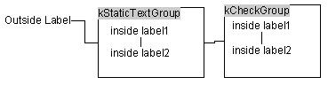
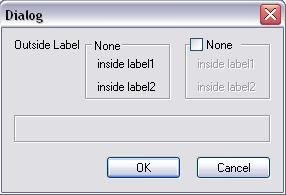
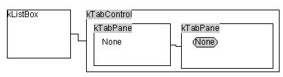
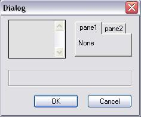
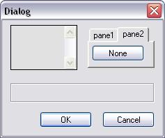
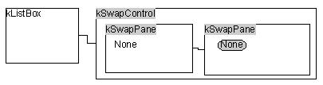
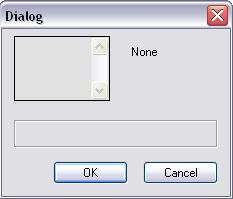

# Create group control

Group controls can be used instead of whatever other control, but they can be resized manually with a third handle position on the bottom-right corner of the bounding box of the control.

The controls that lie within the group controls should be fully fitted within the bounding of the group control. The relations within each group control should start from the top-left-most control within the boundaries of the group control. This means that the first group control is the top-left-most, and all others arrange according to it.

And here is the result dialog. Note the outside label control is fully outside the group control's boundaries, and thus it is related to them. The relation between two group controls describes their relation in the layout. The inner labels are fully within the groups.

# Create tab control

For the tab control, you have to use the `TabControl` Dialog Builder Control type to represent the control, and use `TabPane` to represent each pane in the control. When creating a tab control, you have to put a tab pane control (or whatever other control) and manually change the control type to "Tab Control" since there is no tool prepared for direct creation.

You put all `TabPane` objects within the boundary of the `TabControl` object as if the `TabControl` is the container of panes (actually, that's what it is).

You can see how the tab pane controls are positioned totally within the boundaries of the tab control. Also, the tab panes are connected with their handles. The left tab pane is attached to the right one with its right handle, which describes the tab order (or pane indexes).

The left-most pane is the first one, and the next follows the right relation. Note that if you don't relate it, it won't be recognized as a pane for this tab control.

The dialog produced is like this:

  

# Create swap control

The swap control is the same as the tab control, except that there is no tool for direct creation of swap controls. You have to put a tab control (or whatever control) and manually change the type to swap control or swap pane.

You have to use the `SwapControl` Dialog Builder Control type to represent the control, and use `SwapPane` to represent each pane in the control.

You put all `SwapPane` objects within the boundary of the `SwapControl` object as if the `SwapControl` is the container of swap panes (actually, that's what it is).

You can see how the swap pane controls are positioned totally within the boundaries of the swap control. Also, the swap panes are connected with their handles. The left swap pane is attached to the right one with its right handle, which describes the swap order (or pane indexes).

The left-most pane is the first one, and the next follows the right relation. Note that if you don't relate it, it won't be recognized as a pane for this swap control.

The dialog produced is like this:

# See Also

- [Dialog Builder](Dialog%20Builder.md)  
- [Creating handler class for VectorScript layout dialog](Dialog%20handler%20class%20for%20VectorScript%20layout%20dialog.md)  
- [Creating handler class for manual layout dialog](Dialog%20handler%20class%20for%20manual%20layout%20dialog.md)
