# Download

## Vectorworks 2022

The Dialog Builder can be added to Vectorworks via the menu command:

`Help -> Install Partner Products...`

Select the 'Vectorworks Developer' category on the left, and open the 'Dialog Builder' where you'll have an install button.

## Vectorworks 2021
## Vectorworks 2019
## Vectorworks 2018

The dialog builder is available in any distribution. It has to be enabled via a document script:

```vs
EnableDialogBuilder;
```

Running this will restart Vectorworks, and a new palette will be created in the active workspace along with a sub-menu under Tools/Third-party.

## Vectorworks 2017

**The Dialog Builder:**
- [(Win) Dialog Builder for Vectorworks 2017](images/DebugModule.VW2017.Win.zip)
- [(Mac) Dialog Builder for Vectorworks 2017](images/DebugModule.VW2017.Mac.zip)

You can use the following workspace to get the Dialog Builder tools and menu commands only:
- [Dialog Builder Workspace File for Vectorworks 2017](images/Dialog_Builder.2017.zip)

## Vectorworks 2016

**The Dialog Builder:**
- [(Win) Dialog Builder for Vectorworks 2016](images/DebugModule.VW2016.Win.zip)
- [(Mac) Dialog Builder for Vectorworks 2016](images/DebugModule.VW2016.Mac.zip)

You can use the following workspace to get the Dialog Builder tools and menu commands only:
- [Dialog Builder Workspace File for Vectorworks 2016](images/Dialog_Builder.2016.zip)

## Vectorworks 2015

**The Dialog Builder:**
- [(Win) Dialog Builder for Vectorworks 2015](images/DebugModule.VW2015.Win.zip)
- [(Mac) Dialog Builder for Vectorworks 2015](images/DebugModule.VW2015.Mac.zip)

You can use the following workspace to get the Dialog Builder tools and menu commands only:
- [Dialog Builder Workspace File for Vectorworks 2015](images/Dialog_Builder.2015.zip)

**Note:** This version of the dialog builder supports the new Resource Format used by Vectorworks 2015. Specify the 'Resource Root' value in the Layout Settings dialog to be the name of your VWR folder (without the extension).

The Dialog Builder still supports the legacy (number-based) resources. The options have been moved to the 'Layer Vis Props' page of the Layout Settings dialog. They are defaulted to zero, which will make the Dialog Builder use the VWR resource root. When importing older dialogs, these values will be non-zero and the Dialog Builder will export indexed resources.

In any case, old indexed resources or new, VWR resource root **must** be specified. When exporting the resource, you will be prompted for a location for the output. Select the VWR root folder as the Dialog Builder will export the appropriate sources within the 'DialogLayout' and 'Strings' sub-folders.

## Vectorworks 2014

**The Dialog Builder:**
- [(Win) Dialog Builder for Vectorworks 2014](images/DebugModule.VW2014.Win.zip)
- [(Mac) Dialog Builder for Vectorworks 2014](images/DebugModule.VW2014.Mac.zip)

You can use the following workspace to get the Dialog Builder tools and menu commands only:
- [Dialog Builder Workspace File for Vectorworks 2014](images/Dialog_Builder.2014.zip)

## Vectorworks 2013

**The Dialog Builder:**
- [(Win) Dialog Builder for Vectorworks 2013](images/DebugModule.VW2013.Win.zip)
- [(Mac) Dialog Builder for Vectorworks 2013](images/DebugModule.VW2013.Mac.zip)

You can use the following workspace to get the Dialog Builder tools and menu commands only:
- [Dialog Builder Workspace File for Vectorworks 2013](images/Dialog_Builder.2013.zip)

## Vectorworks 2012

**The Dialog Builder:**
- [(Win) Dialog Builder for Vectorworks 2012](images/DebugModule.VW2012.Win.zip)
- [(Mac) Dialog Builder for Vectorworks 2012](images/DebugModule.VW2012.Mac.zip)

**Additional Vectorworks Document Tools:**
- [(Win) Debug List View for Vectorworks 2012](images/DebugListView.Win.2012.zip)

You can use the following workspace to get the Dialog Builder tools and menu commands only:
- [Dialog Builder Workspace File for Vectorworks 2012](images/Dialog_Builder.2012.zip)

# Concept

Dialog Builder is a set of tools and menu commands that allows you to visually design VectorWorks Layout Dialogs using VectorWorks itself.

This version of the dialog builder is a direct inheritance of Charles Chandler's 'Dialog Builder 5' with the same concept behind.

[Dialog Layout With Dialog Builder](images/DialogLayoutWithDialogBuilder.doc)

# Setting up the tools

Download and extract the Dialog Builder files and place them in your Plug-Ins folder. Download and extract the Dialog Builder Workspace and place the file in your Workspaces folder.

There are also some VectorScript plug-ins that get created when VectorWorks starts from the Dialog Builder Library. These plug-ins are placed under your user folder: `<user>\Application Data\Nemetschek\VectorWorks\13\Plug-ins`

Then, you have to start VectorWorks and switch to the Dialog Builder Workspace. The menu for Dialog Builder should look like this:

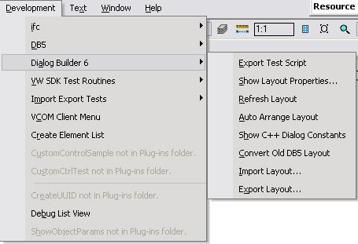

- **Export Test Script** -- exports the current layout as test `.vs` file, so you could run it with the help of the test run tool and see how the designed dialog will behave.
- **Show Layout Properties...** -- Shows a dialog allowing the user to edit the current layout (current VectorWorks layer) properties.
- **Refresh Layout** -- redraws the current layout.
- **Auto Arrange Layout** -- reposition the control objects in the layout (the VectorWorks layer) so they look similar to what will be on the dialog.
- **Show C++ Dialog Constants** -- Show constants definition for C++ use. This is a set of `#define`s so they can be copy-pasted into dialog handler code in C++.
- **Convert Old DB5 Layout** -- Converts a loaded DB5 layout in the current layer into the new DB6 controls. Note that connections are not currently maintained.
- **Import Layout...** -- Imports a Dialog Layout from XML or VS file into an empty VW layer. Note that importing from VS will succeed only if that VS file has been exported with the DialogBuilder export tool and contains XML layout definition inside (see layout properties, last page).
- **Export Layout...** -- Exports the current Dialog Layout into an XML file.

The tool palette should look like this:

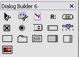

- **Test Run Tool** -- allows the current layer (layout) to be exported as a temporary file and run to see the dialog running.
- **Export Tool** -- allows exporting the current layer (layout) for different tasks.
- **Renumbering Tool** -- allows automatic or manual renumbering of the controls in the layout.
- All other tools are to create different types of controls in the layout (layer).

# Creating Layout

When designing a dialog you put all controls inside one VectorWorks layer. The layer acts as the dialog layout. To setup information about this layout you can use the tools (their layout properties button or the menu command).

The layout settings dialog looks like this:

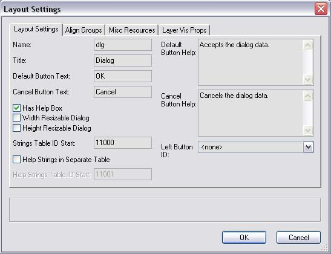

The first tab allows you to set name and title for the dialog. The name is used as variable name for the dialog inside the code.

- **Strings Table ID Start** allows you to specify ID for the STR# table that will contain the strings for this dialog for a SDK plug-in. This value is also the TEXT resource for the `.vs` file for the SDK plug-in.

- **Help Strings in Separate Table** allows you to specify that help strings for the dialog should go to separate table. If not selected they go in the same table as the texts for the controls.

- **Left Button ID** allows you specify which control should be used as 'Left Control' for the dialog. Left controls appear on the left-bottom-most corner of the dialog in the line with 'OK' and 'Cancel' buttons. They get automatically moved with the bottom edge of the dialog when it is resized.

**Note:** The control that is set to be 'left control' should be attached to the other controls hierarchy (using right or bottom handles) in the dialog.

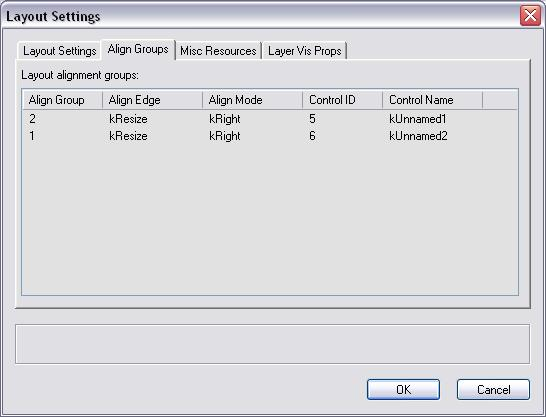

This tab is informative. It shows what align groups are used in this layout. This will help you orient with the groups in really big layouts.

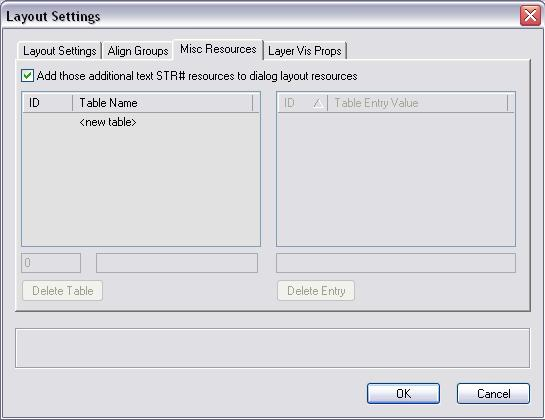

This tab allows you to specify additional STR# resources for this dialog. This is for strings that are inseparable part of the dialog and used nowhere else. The exporting routines automatically puts definitions for these strings, so they are easy to use within the dialog handler code.

The check box controls if those additional resource strings should be added in separate STR# tables, or should be added at the end of the main resource table for the control's texts.

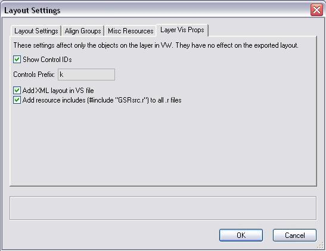

This is settings page and has nothing to do with the exported layout. It is used to set up the way the layout is presented on the VectorWorks layer.

- **Control Prefix** is the prefix that is used for the control variable names.

- **Add XML layout in VS file** -- when checked, when exporting the VS file it includes VectorScript comment at the end of the VS file which contains the XML representation of the current dialog layout. This way this VS file could be used to import back the dialog layout using the 'Import Layout...' menu command.

- **Add resource includes** -- when checked all to `.r` files will be added resource `#include`. This is mainly focused on Mac project files. If your `.r` files has those includes, these `.r` files can be included in the build; If you dont have the includes then those files will not be able to be build and they have to be excluded from the project (from the build target).

By default this option is turned on. The code that's being added to the `.r` files is as follows:

```c
#ifndef REZ_FOR_MACHO
    #define REZ_FOR_MACHO 0
#endif

#if REZ_FOR_MACHO
    #include <Carbon/Carbon.r>
#else
    #include "MacTypes.r"
#endif

#include "GSRsrc.r"
```

# Dialog Builder Control

The Dialog layout controls are presented on VectorWorks layer with a plug-in object 'Dialog Builder Control'. This object is used for all types of layout control which are specified by the 'Type' parameter.

The control has two handles: on right and on bottom. These handles are used to describe the relations between the controls. When you put new control its handles are on the right and on the bottom side of its bounding box. To attach its right neighbor, you should grab the handle with the mouse, move it over the other (within its bounding box) control and place the handle there with single click.

**Note:** You should have all your controls in the layout arranged using the handles. If one control, or a bunch of controls are not related to others, they won't be visible in the exported dialog (they won't be exported). Also note that the upper left most control is the first one for the dialog.

Here are the parameters of this plug-in object:

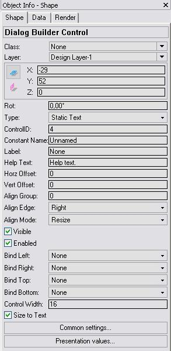

Most of the parameters are common to all types controls. However the last parameter changes visibility from one type to another, allowing you fast edit parameters for commonly used controls.

For example the 'Static Text' control has 'size to text' but others don't. The 'List Box' has height parameter but others may not have this.

With parameters you are allowed to set only one Align Group of this control. Zero group ID means that this control doesn't belong to a group.

**Common Settings...** button brings up the dialog:

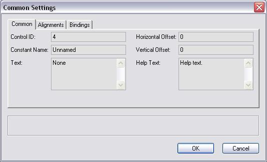

This pane allows you to specify common settings for the control. These settings are present as parameters, but here you have bigger edit controls so you could more easily enter long strings.

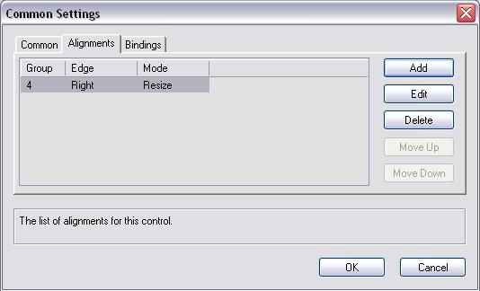

This pane allows you to specify more than one alignment group for this control.

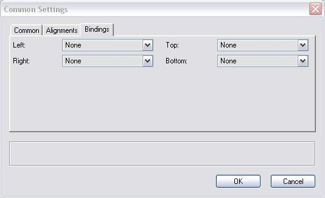

In this pane you specify binding for this control if it is a part of resizable layout.

# Test Run Tool

Test run tool (the first icon shown in the tool palette above) is used to export as temp `.vs` file the current layout dialog and run it. So the user would see what he actually gets. When the tool is selected the data bar contains buttons to control:

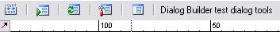

The buttons have functionality as follows:

- Exports the temp `.vs` file. This file is saved in the user location and it is called `_DialogBuilder6Test.vs`.
- Running the exported test file.
- Refresh the current layout.
- Show the current layout properties.
- Arrange the current layout controls.

# Export Tool

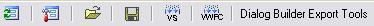

This tool allows you to export the current layout as different files for different purposes.

The buttons have functionality as follows:

- Refresh the current layout.
- Shows the current layout properties.
- Import layout from XML or VS file that contains XML layout definition.
- Export the layout to XML file.
- Export `.vs` and `.r` files for the layout definition for SDK plug-in. This tool asks you to enter name for the `.vs` file, and this name will be used for the `.r` file too. Both files will be written in the chosen location. The `.vs` file contains the vector script function that creates the dialog and the `.r` file contains the resource strings for this dialog. Also the `.r` file contains 'read' as 'TEXT' for the `.vs` file, so all you need is to `#include` the `.r` file in your PluginResources.r file.
- Export class that handles this dialog. This class inherits VWDialog from the new VWUI.lib from the SDK.

# See Also

[Dialog Builder Samples](Dialog%20Builder%20Samples.md) | 
[Creating handler class for VectorScript layout dialog](Dialog%20handler%20class%20for%20VectorScript%20layout%20dialog.md) | 
[Creating handler class for manual layout dialog](Dialog%20handler%20class%20for%20manual%20layout%20dialog.md)

