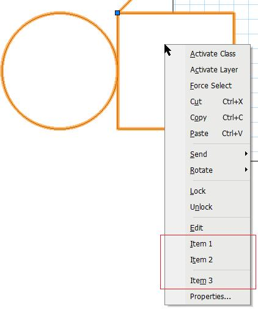

By [Vladislav Stanev](mailto:vstanev@nemetschek.net)

## What's that

The parametric objects can modify the context menu -- the menu that appears on right-click on the object instance in the drawing.

The Custom Context Menu is an addition to the context menu that is created by VectorWorks for that object. The Custom Context menu is defined for the parametric type from the plug-in and is the same for all instances of that parametric type.

## Setting up

To enable "Custom Context Menu" for that parametric type, your parametric plug-in should have **Parametric Extended Properties** enabled through the resources **Enabling Extended Properties**.

Then you need to handle the **kObjOnInitXProperties**.

The plug-in must set up the extended properties and enable "Custom Context Menu". To do that, you have to set the following extended properties: **kObjXPropHasContextMenu**.

**Note**: The extended properties are manipulated through a [VCOM (VectorWorks Component Object Model)](VCOM%20(Vectorworks%20Component%20Object%20Model).md) interface **IExtendedProps** which is part of **PluginSupport**.

```cpp
case kObjOnInitXProperties: {
  // obtain the interface for accessing the extended properties
  using namespace VectorWorks::PluginSupport;
  VCOMPtr<IExtendedProps>	pExtProps( IID_ExtendedProps );

  // Enable Custom Menu Command
  pExtProps->SetObjectProperty(objectID, kObjXPropHasContextMenu, true);
}
```

## Creating the Custom Context Menu

When the user right-clicks on a Custom Context Menu enabled plug-in, VectorWorks sends out the [kObjOnContextMenuInit](SDK:Plug-in%20Object%20Events#kObjOnContextMenuInit) event to let the plug-in construct the Custom Context Menu.

**Note**: The Custom Context Menu items get merged with the context menu that VectorWorks provides.

```cpp
case kObjOnContextMenuInit: {
    const ObjectContextMenuEvent* pEventData           = (const ObjectContextMenuEvent*) message;
    IContextMenuProvider*         pContextMenuProvider = (pEventData && pEventData->fData)
                                                                 ? (IContextMenuProvider*) pEventData->fData : NULL;
    if ( pContextMenuProvider ) {
        pContextMenuProvider->AddItem( "Item 1" );
        pContextMenuProvider->AddItem( "Item 2" );
        pContextMenuProvider->AddItemSeparator();
        pContextMenuProvider->AddItem( "Item 3" );
    }

   break;
}
```

The plug-in builds the context menu using the interface:

```cpp
//----------------------------------------------------------
class IContextMenuProvider
// Context menu provider interface for parametric objects
{
public:
    virtual Sint16  AddItemSeparator() = 0;
    virtual Sint16  AddItem(const TXString& text) = 0;
    virtual bool    AddItem(const TXString& text, IContextMenuProvider*& outSubMenuProvider) = 0;
	
    virtual void    EnableItem(Sint16 itemID, bool bEnable) = 0;
    virtual void    CheckItem(Sint16 itemID, bool bChecked) = 0;
};
```

## Custom Menu Item Select

When the user selects an item from the Custom Context Menu, VectorWorks sends out the [kObjOnContextMenuEvent](SDK:Plug-in%20Object%20Events#kObjOnContextMenuEvent) event to allow the plug-in to handle it correctly:

```cpp
case kObjOnContextMenuEvent: {
    const ObjectContextMenuEvent* pEventData    = (const ObjectContextMenuEvent*) message;
    if ( pEventData ) {
        TXString    msg;
        msg.Format( "Menu id=%d", pEventData->fActiveMenuID );
        gSDK->AlertInform( msg );
    }

    break;
}
```

## Sample

The sample Custom Context Menu looks like this:

**Note**: The Custom Context Menu items get merged with the context menu that VectorWorks provides.


