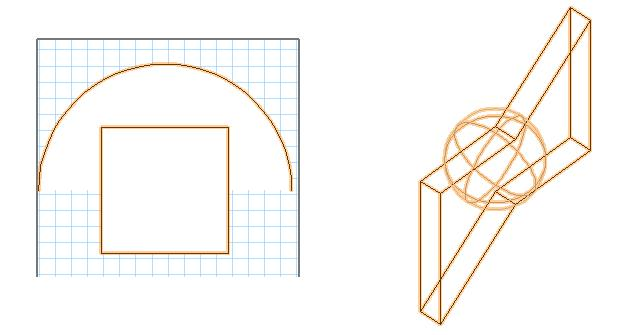
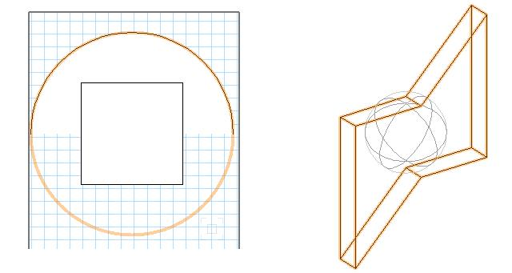

By [Vladislav Stanev](mailto:vstanev@nemetschek.net)

## What's that

When you have a parametric object in the drawing that is selected, the selection indication looks like all the inner objects of the parametric are selected.



From VectorWorks 2009, parametric objects are capable of customizing the selection indication by providing geometry which will be used to present the selection. That geometry will not be rendered; it will just determine the selection and pre-selection indication.



As you can see in the image above, when the object has custom selection, you can simplify the selection indication for complex geometrical objects.

**NOTE!** The geometry that determines the selection indication is kept inside each instance.

## Creating

The plug-in creates geometry that is to be used as selection indication and puts the geometry into a special group with the call **VectorWorks::ISDK::SetCustomObjectSelectionGroup**.

You can pass a handle to whatever object or a handle to a group object that contains geometry.

2D geometry inside the group will be presented as 2D selection indication, and 3D objects -- as 3D selection indication.

```cpp
case kParametricRecalculate : {

  // -------------------------------------------------------
  // prepare selection indication geometry
  MCObjectHandle	hSelGroup	= gSDK->CreateGroup();

  // 2D selection
  MCObjectHandle	h2DSel		= gSDK->CreateArcN( WorldRect( -100, 100, 100, -100 ), 0, 360 );
  gSDK->AddObjectToContainer( h2DSel, hSelGroup );

  MCObjectHandle	h3DSel1		= gSDK->DuplicateObject( hExtrude );
  gSDK->AddObjectToContainer( h3DSel1, hSelGroup );

  // set selection geometry for this object
  gSDK->SetCustomObjectSelectionGroup( objHand, hSelGroup );
}
```

*2014/08/29 SDK 2013:* Apparently, when creating other content between `AddObjectToContainer` and `SetCustomObjectSelectionGroup`, it will corrupt the group. This will occur mostly on new objects.
