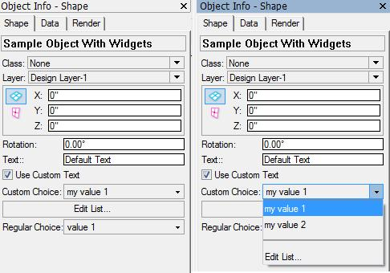

By [Vladislav Stanev](mailto:vstanev@nemetschek.net)

## What's that

See [Parametric Custom Shape Pane](Parametric%20Custom%20Shape%20Pane.md) for more basic information.

Parametric Objects can customize the ["Object Info - Shape Pane" palette](Parametric%20Custom%20Shape%20Pane.md) in VectorWorks.


By default, the "Object Info - Shape Pane" palette shows the parameters of the parametric object as they are defined from the resources of the parametric plug-in. The types of the widgets that appear in the palette are determined by the types of the parameters in `SParametricParamDef`.

## The Problem

A parametric plug-in is able to override that standard behavior and customize the appearance of the "Object Info - Shape Pane" Palette.

This approach allows a complex plug-in parametric to make a good distinction between data and UI of the parameters.

- **Data** is the internal record that holds the parameters of the object. This makes one format with this name when an object of this type is created. Each instance of that object contains a record instance in its AUX list holding the parameters for that particular parametric object instance.
- **UI** is the custom-defined widgets that appear in the Shape pane. The plug-in can define the widgets that appear in the shape pane and can bind them to the parameter's data. This will make VectorWorks automatically transfer data between the widgets and the parameters record.

The sample demonstrated here defines a plug-in parametric object with one custom and one normal popup. The custom popup has an 'Edit List...' option at the end, which allows the list contents to be edited through a dialog.

The resulting sample object's shape pane looks like this:



## Setting up: `kObjOnInitXProperties`

In order to create a custom user interface for a parametric object, your parametric plug-in should have [Parametric Extended Properties](Parametric%20Extended%20Properties.md) enabled through the resources [Enabling Extended Properties](Parametric%20Extended%20Properties.md).

Then you need to handle the **kObjOnInitXProperties**.

The plug-in must set up the extended properties and enable a customizable user interface. To do that, you have to set the following extended properties: **kObjXPropHasUIOverride**.

**Note** that the extended properties are manipulated through a [VCOM (VectorWorks Component Object Model)](VCOM%20(Vectorworks%20Component%20Object%20Model).md) interface **IExtendedProps** which is part of the **PluginSupport** category.

```cpp
case kObjOnInitXProperties: {
  // obtain the interfact for accessing the extended properties
  using namespace VectorWorks::PluginSupport;
  VCOMPtr<IExtendedProps>	pExtProps( IID_ExtendedProps );

  CodeRefID objectID	= (CodeRefID) message;

  // 1. Enable custom UI
  // enable custom UI for that plug-in parametric type
  // all instances of that parametric will have the custom UI defined here
  pExtProps->SetObjectProperty( objectID, kObjXPropHasUIOverride, true );

  // 2. Define the custom UI
  // define custom UI for that parametric type
  IWidgetsEditProvider*	pWidgetsProvider	= NULL;
  if ( VCOM_SUCCEEDED( pExtProps->GetObjComponentTypeWidgets( objectID, kObjectRootComponentTypeID, pWidgetsProvider ) ) ) {
    pWidgetsProvider->AddWidget( kTextWidgetID, "p1" );
    pWidgetsProvider->AddWidget( kStateCheckWidgetID, "p2" );
    pWidgetsProvider->AddWidget( kValuesPopupWidgetID, "p3" );
    pWidgetsProvider->AddWidget( kButtonWidgetID, kWidgetButton, "Edit List..." );
    pWidgetsProvider->AddWidget( kNormalPopupWidgetID, "p4" );
  }

  // 3. Enable widget state notification
  // enable notification for updating widget visibility and enable state
  pExtProps->SetObjectProperty( objectID, kObjXHasCustomWidgetVisibilities, true );

  // 4. Enable states so we could get when the widget has been selected
  // prepare flags for the state event that is to be received
  short  stateEventFlags  = kParametricStateEvent_ResetStatesEvent;
  gSDK->SetProgramVariable( varParametricEnableStateEventing, & stateEventFlags );
  pExtProps->SetObjectProperty( objectID, kObjXPropAcceptStates, true );
}
```

### 1. Enable custom UI

Set to `TRUE` the **kObjXPropHasUIOverride** extended property.

This will make VectorWorks use the custom UI defined by the plug-in.

All parametric instances of this type will share these widget sets. That is because the widgets are defined for the parametric type. However, update notifications are sent per instance, so the plug-in could determine the widget state (visible/invisible, enabled/disabled) through **kObjXHasCustomWidgetVisibilities** extended property. See below.

### 2. Define the custom UI

Uses **IExtendedProps::GetObjComponentTypeWidgets** to obtain the widgets edit provider interface **IWidgetsEditProvider** that provides functions for defining the custom widgets for this parametric object type. Note that `kObjectRootComponentTypeID` is passed to retrieve the widgets editor provider for the parametric object itself.

The widgets are added one by one, and each widget has an Identifier. This identifier is used to recognize that particular widget later on. The widget identifiers **SHOULD NOT** repeat; each widget should have a unique identifier number. This uniqueness should be ensured by the developer of the plug-in. VectorWorks doesn't check that.

The widgets in this example are added with an automatic data hook to the parametric's record (by specifying the record field name). This means that data from and to the widget will come from that specified record field.

The widget types are determined by the type of the parameters in this example. You can define your widgets by type; see **SWidgetDefinition#Remarks**.

`"p1"`, `"p2"`, ..., `"p5"` are universal parameter names.

### 3. Enable widget state notification

Set to `TRUE` the **kObjXHasCustomWidgetVisibilities** extended property.

This will make VectorWorks send **kObjOnWidgetPrep** events to the plug-in parametric object, specifying the [`MCObjectHandle`](Type%20MCObjectHandle.md) to the instance which needs its widgets updated. Note that the passed [`MCObjectHandle`](Type%20MCObjectHandle.md) for the instance can be **NULL** if the format record for that parametric has been edited.

This will allow the plug-in to update the widgets per instance, so each instance of this parametric type will look correct. We want in the sample to control the visibility and enable state of the widgets.

### 4. Enable states notifications

Set to `TRUE` the **kObjXPropAcceptStates**extended property.

This will make VectorWorks send **kObjOnAddState** events to the plug-in parametric object, specifying the [`MCObjectHandle`](Type%20MCObjectHandle.md) to the instance to which this state is related.

In order for the states to work, the program variable **varParametricEnableStateEventing** needs to be set.

There is one reason we use that in the example here. With the help of this event, in the sample, we'll recognize when 'Edit List...' has been chosen from the popup widget.

## Updating widgets: `kObjOnWidgetPrep`

Handling **kObjOnWidgetPrep** allows the sample to update the widget state. Also, it allows updating the dynamic popups with the correct list of items.

**Note:** This event is being called with the actual instance [`MCObjectHandle`](Type%20MCObjectHandle.md) handle inside `hParametricObj`. However, this may be **NULL** if there is no instance; in that case, the event is called to update the widgets inside the properties dialog when editing the parametric format record.

```cpp
case kObjOnWidgetPrep: {
  // 1. Retreive data from the call
  OnObjectWidgetPrepCall* pThisCall        = (OnObjectWidgetPrepCall*) message;
  IWidgetsProvider*       pWidgetProvider  = pThisCall ? (IWidgetsProvider*) pThisCall->fpWidgetProvider : NULL;

  // 2. Check the widgets provider from the event data
  //    and initialize the object data instance (the class that is responsible for reading/writing the parametric data)
  if ( pWidgetProvider && objData.SetObject( hParametricObj ) ) {
    // 3. Get the widgets that we need to alter
    //    widgets are recognized by IDs specified when initializing them
    SWidgetDefinition*  pTextWidget     = pWidgetProvider->GetWidgetByID( kTextWidgetID );
    SWidgetDefinition*  pPopupWidget    = pWidgetProvider->GetWidgetByID( kValuesPopupWidgetID );
    SWidgetDefinition*  pButtonWidget   = pWidgetProvider->GetWidgetByID( kButtonWidgetID );
    if ( pTextWidget && pPopupWidget && pButtonWidget ) {
      // 4. Setting the proper visible and enable/disable state of the widgets
      //    according to the object data
      pTextWidget->fWidgedVisible       = objData.GetUseCustomText();
      pPopupWidget->fWidgetEnabled      = objData.GetUseCustomText();
      pButtonWidget->fWidgetEnabled     = objData.GetUseCustomText();

      SObjectWithWidgetsData&	data	= objData.GetData();

      // 5. Rebuild the popup list if we need to
      //    inside data object class the user data holds persistent array of the dynamic items in the popup
      //    At this point we recognize if this list has been change (data.IsPopupListDirty)
      //    and update the popup with the new items
      IWidgetDataPopup*	pPopupData	= dynamic_cast<IWidgetDataPopup*>( pPopupWidget->fpWidgetData );
      if ( pPopupData && (pPopupData->GetCount() == 0 || data.IsPopupListDirty() ) ) {
        // 6. clean up the popup and fill it in with the new items
        pPopupData->Clear();

        TVWMemoryStringArray&	arrPopupList	= data.GetPopupListForEdit();
        size_t					popupListCnt	= arrPopupList.size();
        for(size_t i=0; i<popupListCnt; i++) {
          const TXString&	value	= arrPopupList[ i ];
          TXString		id;
          id.Format( "%d", (i+1) );
          pPopupData->Add( id, value );
        }

        // 7. Always add a divider line and 'Edit List...' at the end of the popup
        //    We need this to be able to modify the list though selecting this item in the popup
        pPopupData->Add( "div", "-" );
        pPopupData->Add( "edit", TXString( (short)11000, (short)2 ) );

        // 8. Clearup dirty flag so we dont fill the popup each time the widgets and updated
        //    This is done purely by performance needs
        data.ClearPopupListDirty();
      }
    }
  }

  // 9. Let VW knows that we handled this event
  //    NOTE: IMPORTANT to return that this event is handled
  //    so VW will respect the changes made in this event
  reply	= kObjectEventHandled;

  break;
}
```

## Handle widget button: `kObjOnObjectUIButtonHit`

The sample handles **kObjOnObjectUIButtonHit** to catch the pressing of the widget button. The choice list edit dialog is shown, allowing the user to edit the list.

This event will not cause an update of the widgets or the object, which is why **ISDK::ResetObject** is called.

```cpp
case kObjOnObjectUIButtonHit: {
  // 1. Recognize of the edit list widget button have been pressed
  //    and init the data object
  if ( message == kButtonWidgetID && objData.SetObject( hParametricObj ) ) {
    // 2. show edit list dialog to update the items list 
    if ( ::EditChoicesList( objData, objData.GetPopupText() ) ) {
      // 3. reset the parametric to reflect changes
      gSDK->ResetObject( hParametricObj );
    }
  }

  break;
}
```

## Handle widget change: `kObjOnAddState`

The sample has "Edit List..." in the popup, which should bring up a list edit dialog. In order to do that, it needs to know when the user has selected that option from the dynamic popup list.

Inside the message, we recognize it is of type parameter changed and check if it is the "Edit List..." item selected. Note that for parameter change, this event is called after updating the data record, so the sample just reads the selection from the parametric record (through the data object).

The old value is used in order to select in the list edit dialog the item that has been previously selected.

The widget update will happen automatically because the parameter change event will reset the object anyway.

```cpp
case kObjOnAddState: {
  // 1. obtain the interfact for accessing the extended properties
  using namespace VectorWorks::PluginSupport;
  VCOMPtr<IExtendedProps>	pExtProps( IID_ExtendedProps );

  // 2. get state event data
  ObjectState*	pObjState	= (ObjectState*) message;
  if ( pObjState && objData.SetObject( hParametricObj ) ) {
    // 3. recognize the state event
    ObjectState::EStateType		objState	= (ObjectState::EStateType) pObjState->fSpecifier;
    if ( objState == ObjectState::kParameterChangedReset ) {
      const ObjectStateData_ParamChanged*	pParamChangedData	= (const ObjectStateData_ParamChanged*) pObjState->fData;

      // 4. recognize the changed widget
      //    we are interested in dynamic popup widget
      if ( pParamChangedData->fWidgetID == kValuesPopupWidgetID ) {
        // 5. recognize the selection in the dynamic widget
        TXString	choiceSel	= objData.GetPopupText();
        if ( choiceSel == "div" || choiceSel == "edit" ) {
          Str255		oldValue;
          if ( pParamChangedData->fParameterValidOldValue &&
            pParamChangedData->fParameterOldValue.GetStr255( oldValue ) )
          {
            // 6. show list edit dialog
            if ( ! ::EditChoicesList( objData, oldValue ) ) {
              // if not handled restore prev
              objData.SetPopupText( oldValue );
            }
          }
        }
      }
    }
  }

  break;
}
```

## Resources

The resource file for this example defines the parameters of the object.

As you can see, the parameter that contains the custom popup data is defined as a popup, and its **`Chc#** resource contains no elements.

Also, the resource defines a string used for the 'Edit List...' value. This way, this value can be localized.

```r
resource 'Chc#' (128) {
    /* Universal choice string */
    /* Localized choice string */
  {
  }
};

resource 'Chc#' (129) {
    /* Universal choice string */
    /* Localized choice string */
  {
    "v1",  "value 1",
    "v2",  "value 2",
    "v3",  "value 3",
  }
};

resource 'Prm#' (128) {
    /* Universal parameter name */
    /* Localized parameter name */
    /* Default value */
    /* Fill byte */
    /* Type */
    /* Choice ID for choices (Chc# resource) */
  {
    /* 1 */ "p1", "Text:",           "Default Text", 4, 0,   /*kFieldText*/
    /* 2 */ "p2", "Use Custom Text", "1",            2, 0,   /*kFieldBoolean*/
    /* 3 */ "p3", "Custom Choice",   "c2",           8, 128, /*kFieldPopUp*/
    /* 4 */ "p4", "Regular Choice",  "c1",           8, 129, /*kFieldPopUp*/
  }
};

resource 'STR#' (11000) {
  {
    "------------",
    "Edit List...",
   }
};
```

## Other Stuff

This sample uses user data to store the list of items for the dynamic popup.

The widget update just fills in the list of items in the popup if the list is updated since the last filling.

Then it is up to the plug-in to modify that list. The sample uses two ways to update the list:

- A UI button that shows the edit dialog, allowing the user to edit the list.
- A special item in the popup which, when selected, shows the edit dialog.
