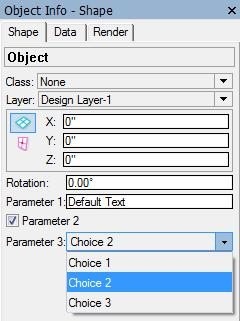
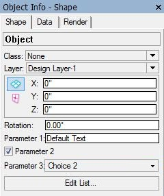

By [Vladislav Stanev](mailto:vstanev@vectorworks.net)

## What's that

Parametric Objects can customize the "Object Info - Shape Pane" palette in Vectorworks.



By default, the "Object Info - Shape Pane" palette shows the parameters of the parametric object as they are defined from the resources of the parametric plug-in. See [Parametric General Info](Parametric%20General%20Info).

The image above shows the "Object Info - Shape Pane" palette for an object with the following parameters:

```cpp
static SParametricParamChc gArrChoices[] = {
    { 128,    "c1",   {11002, 1} },
    { 128,    "c2",   {11002, 2} },
    { 128,    "c3",   {11002, 3} },
    // TERMINATE
    { NULL, NULL, {0,0} }
};

static SParametricParamDef gArrParameters[] = {
    { "p1",            {11001, 1},        "Default Text",    "Default Text",    kFieldText,      0 },
    { "p2",            {11001, 2},        "1",               "1",               kFieldBoolean,   0 },
    { "p3",            {11001, 3},        "@11002,2",        "@11002,2",        kFieldPopUp,     128 },
    // TERMINATE
    { NULL, {0,0}, NULL, NULL, EFieldStyle(0), 0 }
};
```

**Note:** The '@' is used for the default text of a parameter if the string is to come from a STR# resource.

## The Problem

A parametric plug-in is able to override that standard behavior and customize the appearance of the "Object Info - Shape Pane" Palette.

This approach allows a complex plug-in parametric to make a good distinction between data and UI of the parameters.

### Terminology

- **Data**: The internal record that holds the parameters of the object. Data is defined by the static `SParametricParamDef` variable passed to the constructor of **VWExtensionParametric**. This creates one format with this name when an object of this type is created. Each instance of that object contains a record instance in its AUX list holding the parameters for that particular parametric object instance.

- **UI**: The custom-defined widgets that appear in the Shape pane. The plug-in can define the widgets that appear in the shape pane and bind them to the parameter's data. This will make Vectorworks automatically transfer data between the widgets and the parameters record.

The sample demonstrated in this article will create a custom shape pane adding one additional button by manually arranging the OIP.



## Setting up: Registering an Event Sink

To create a custom user interface for a parametric object, your parametric plug-in should implement an additional event sink **IProviderShapePane.

First, you need to provide the additional event sink for your [parametric extension class](Parametric%20General%20Info.md).

```cpp
class CExtObjParametricObj : public VWExtensionParametric
{
DEFINE_VWParametricExtension;
public:
                CExtObjParametricObj(CallBackPtr cbp);
    virtual    ~CExtObjParametricObj();

// IExtensionApp
public:
    virtual void DefineSinks();
};
```

The `DefineSinks` function registers classes as event sinks provided by this parametric extension. The VWFC implementation will handle creating and deleting instances of the event sink classes.

```cpp
void CExtObjParametricObj::DefineSinks()
{
    this->DefineSink<CProviderShapePane>(IID_ProviderShapePane);
}
```

The class `CProviderShapePane` is the implementation of the Shape Pane event sink **IProviderShapePane**, which is recognized by the VWIID `IID_ProviderShapePane` that is defined for this sink.

## The IProviderShapePane Event Sink

We have to implement the **IProviderShapePane** interface, which will receive events from Vectorworks about the OIP of the parametric extension.

Here is the header file `ProviderShapePane.h` that defines our sink:

```cpp
#include "VectorWorks/Extension/IProviderShapePane.h"

namespace TesterModule
{
    using namespace VectorWorks::Extension;

    class DYNAMIC_ATTRIBUTE CProviderShapePane : public VCOMImpl<IProviderShapePane>
    {
    public:
                        CProviderShapePane(IVWUnknown* parent);
        virtual         ~CProviderShapePane();

    // IProviderShapePane
    public:
        virtual void VCOM_CALLTYPE    Init(CodeRefID objectID, IExtendedProps* extProps);
        virtual void VCOM_CALLTYPE    Activate(MCObjectHandle hObject, const SSelectionContext& selContext);
        virtual void VCOM_CALLTYPE    Deactivate();
        virtual void VCOM_CALLTYPE    Update(IWidgetsProvider* widgetProvider);
        virtual bool VCOM_CALLTYPE    OnWidgetChange(SShapePaneWidgetOnWidgetChange &data, bool &outNeedReset, bool &outChangeOk);
    };
}
```

And the implementation file `ProviderShapePane.cpp`:

```cpp
using namespace TesterModule;

namespace TesterModule
{
    const Sint32 kWidgetID_Widget1 = 1;
    const Sint32 kWidgetID_Widget2 = 2;
    const Sint32 kWidgetID_Widget3 = 3;
    const Sint32 kWidgetID_Widget4 = 4;

CProviderShapePane::CProviderShapePane(IVWUnknown* parent)
    : VCOMImpl<IProviderShapePane>(parent)
{
}

CProviderShapePane::~CProviderShapePane()
{
}

void CProviderShapePane::Init(CodeRefID objectID, IExtendedProps* extProps)
{
    IWidgetsEditProvider* widgetsProvider = NULL;
    if (extProps && VCOM_SUCCEEDED(extProps->GetObjComponentTypeWidgets(objectID, kObjectRootComponentTypeID, widgetsProvider)))
    {
        widgetsProvider->AddWidget(kTextWidgetID, "p1");
        widgetsProvider->AddWidget(kStateCheckWidgetID, "p2");
        widgetsProvider->AddWidget(kValuesPopupWidgetID, "p3");
        widgetsProvider->AddWidget(kButtonWidgetID, kWidgetButton, "Edit List...");
    }
}

void CProviderShapePane::Activate(MCObjectHandle hObject, const SSelectionContext& selContext)
{
}

void CProviderShapePane::Deactivate()
{
}

void CProviderShapePane::Update(IWidgetsProvider* widgetProvider)
{
}

bool CProviderShapePane::OnWidgetChange(SShapePaneWidgetOnWidgetChange &data, bool &outNeedReset, bool &outChangeOk)
{
    bool eventHandled = false;
    if (data.fWidgetID == kButtonWidgetID)
    {
        gSDK->AlertInform("kButtonWidgetID", "CProviderShapePane::OnWidgetChange");
        eventHandled = true;
    }

    return eventHandled;
}
```

### Notes

1. **Define UI Widget Constants**: Define constants for the UI Widgets to recognize them later in a more C++ way.

2. **The Sink Implementation**: The constructor should accept `IVWUnknown` for the parent of the event sink. Creating this event sink will increment the ref counter of the parent, ensuring the parent is not deleted before the sink.

3. **Init**: Called once for the parametric extension. Uses `IExtendedProps::GetObjComponentTypeWidgets` to obtain the widgets edit provider interface. Widgets are added with unique identifiers.

4. **Activate**: Sent when the OIP is preparing to show a particular instance of the parametric object.

5. **Deactivate**: Sent when the OIP is closing on the object(s) it was activated for.

6. **Update**: Sent when the OIP widgets need to be updated. This must be fast for performance reasons.

7. **OnWidgetChange**: Sent when there is a change to any widget. The `data` parameter provides detailed information about the widget.
