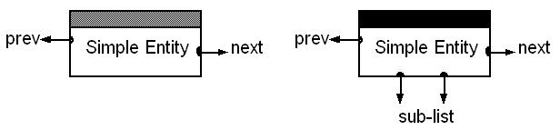
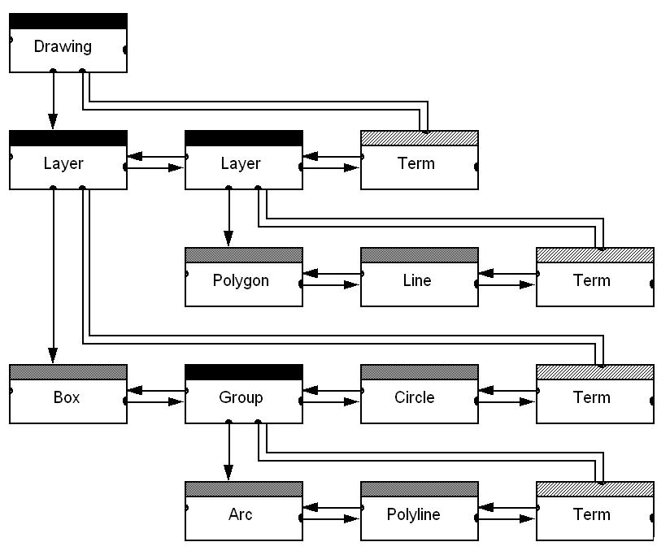

# Entities

The simplest element of the Vectorworks environment is the node. Every node has a type (found by calling `VCOM:VectorWorks:ISDK::GetObjectType`) which indicates what other properties it has, a position in a drawing list (found by calling `VCOM:VectorWorks:ISDK::NextObject`, `VCOM:VectorWorks:ISDK::PrevObject`, and `VCOM:VectorWorks:ISDK::ParentObject`), and an auxiliary list (described below) `VCOM:VectorWorks:ISDK::FirstAuxObject`.

In addition, some entities, called containers, also hold a sub-list of entities and can return the first and last entities in that sub-list. Layers and Groups are examples of container entities. `VCOM:VectorWorks:ISDK::FirstMemberObj`



# Lists

Vectorworks uses two types of lists to hold drawing data, explicitly and non-explicitly terminated lists.

Explicitly terminated lists maintain a node at the very end of the list of the type `VCOM:VectorWorks:ISDK::GetObjectType|kTermNode`. This node is used as both a signal of the end of the list and more importantly to store a reference back up the tree to the list’s parent.

Non-explicitly terminated lists do not have a special termination node, and the end of the list is indicated by a nil reference in the last node’s next pointer. Because this type of list does not have a terminal node, it is not possible to backtrack up the tree to the parent without maintaining a reference to the parent yourself. All lists of drawing objects are explicitly terminated.

In addition to drawing object lists, there is another type of list, the auxiliary list. `VCOM:VectorWorks:ISDK::FirstAuxObject`.

Aux lists provide for supplementary data to be associated with an object (such as record data or cavity lines for a wall) that is saved with the document.

An aux list is an unsorted, non-explicitly terminated list that can be searched by keys. Some records in an object’s aux list may have public interfaces, but most data in the aux lists is private and should not be used.

As mentioned above, the aux list is unsorted which means that a plug-in should not assume the sequence of nodes on that list. A plug-in should search the list for the node type it is interested in, and then verify that it has found the correct node before using it.

Vectorworks defines a special type of aux object for use by plug-in developers, the `VCOM:VectorWorks:ISDK::GetObjectType|kUserDataNode`. It is an aux object with a type of `VCOM:VectorWorks:ISDK::GetObjectType|kUserDataNode` and an internally maintained tag of type `SDK:Types#SDK_Specific|OSType` that the plug-in writer can use as a signature. To create a `VCOM:VectorWorks:ISDK::GetObjectType|kUserDataNode`, define a class or record that descends from UserDataType (defined in MCCallBacks.h) or which contains a UserDataType object as the first member. Either method will reserve the necessary space at the head of the structure for Vectorworks use.

Next, call `VCOM:VectorWorks:ISDK::NewDataObject`, passing it the size and signature of your private DataNodeType. You now have an aux object that can be safely used with the supplied aux lists callbacks. For convenience `VCOM:VectorWorks:ISDK::FindDataObject` has been supplied to simplify locating your private data objects.

# Drawings

Vectorworks Document Structure and List Management



The drawing list can be viewed as a tree. Its root is called the drawing header. Use `VCOM:VectorWorks:ISDK::GetDrawingHeader` to obtain a handle to the drawing header.

The drawing header is a container entity whose sub-list contains all the entities in the drawing. The first level of sub-objects in the drawing header is layers.

The drawing header is the only object that can contain layers, and it contains every layer in the drawing. A layer contains all the entities that are on that layer, but not every entity on the layer is in the layers sub-list.

Some entities on the layer are contained within other entities on the layer.

A rectangle in a group on a layer is contained by both the group and the layer but only appears in the sub-list of the group.

Since the group is in the layer’s sub-list, however, the layer does indirectly contain the rectangle.

The auxiliary list of the drawing header holds all the defining entities global to the document. These include symbol definitions, record formats, worksheets, and command palettes.

# List Traversal

Traversal is useful because it allows you to perform an operation on a set of drawing objects that meet some criteria that you specify.

For example you might want to:
* Move all selected objects three inches to the left;
* Resize all selected objects that are arcs of angles less than ten degrees to ten degree arcs;
* Find every wall in the current layer and insert studs into the layer `<current> construction`

Vectorworks provides two methods to search the drawing list. The first and preferred method is through the routine `VCOM:VectorWorks:ISDK::ForEachObject`. It can perform either a shallow or deep traversal, in drawing order (back to front) starting from any point in the tree.

If you use it to do a deep traversal from the drawing header it will iterate over every object in the drawing. If, instead, you did a shallow traversal from the drawing header it would only return references to the layer objects in the drawing.

`VCOM:VectorWorks:ISDK::ForEachObject` also takes as a parameter a selection clause that allows you to specify certain constraints that an object must meet to be enumerated.

This filtering is limited to the following attributes: is the object selected, editable, a drawing object, or a symbol definition. The last criterion is a special case as symbol definitions are not in the drawing tree, only symbol instances are. Symbol definitions are kept in a separate tree also rooted at the drawing header. They are organized according to the same method drawing objects are (as symbols are comprised of drawing objects).

`VCOM:VectorWorks:ISDK::ForEachObject` works by calling a user supplied function once for every object it finds.

The user supplied function must be of the type `ForEachObjectProcPtr`.

```cpp
typedef void (*ForEachObjectProcPtr)(Handle h, CallBackPtr cbp, void *env);
```

The argument `h` is a handle to the object `ForEachObject` found.

`cbp` is a parameter used in communicating between a plug-in and Vectorworks;

`env` is a pointer to data supplied as a parameter to `ForEachObject`.

It is through `env` that the calling function can share data with the called function. See the tutorials for examples of `ForEachObject`.

It is one of the most important and frequently used functions VectorWorks provides. It is also one of the more difficult to use correctly, so take time to study the examples.

The second method for traversing the drawing tree is through standard tree walking functions.

VectorWorks provides routines to move between siblings in the tree, `VCOM:VectorWorks:ISDK::NextObject` and `VCOM:VectorWorks:ISDK::PrevObject`; to move to the parent of a node, `VCOM:VectorWorks:ISDK::ParentObject`; and to move to the children of a node, `VCOM:VectorWorks:ISDK::FirstMemberObj` and `VCOM:VectorWorks:ISDK::LastMemberObj`.

Using these functions you can implement any type of tree walking algorithm. This flexibility is more difficult to implement and manage than `ForEachObject` so it should only be used when necessary.

# Units

Before discussing some specific information about entities, an understanding of the different coordinate spaces used by Vectorworks is important. Vectorworks defines and manages the space through coordinate systems it imposes on it.

The following are the basic coordinate systems:

## Model

The units presented to the user. Vectorworks never expects these units as parameters and uses them only to display information to the user.

## World

World space is the 3-dimensional Vectorworks universe. The vast majority of internal Vectorworks calculations are performed in world space, and most of the SDK routines that refer to object positions and distances are represented in world space.

World space values are represented by a double precision floating point data type. One world coordinate currently represents one millimeter, but that relationship is not guaranteed to hold in future versions of Vectorworks. See the bottom of this section for a description of constants and functions that can be used to interpret and translate world space values.

## Local

Some Vectorworks entities (symbol definitions, extrudes, multiple extrudes, sweeps, and layer links) use simple entities to define their geometry and store these defining entities in local coordinates. This coordinate system differs from world space only in the offset used to convert to model space.

## View

This coordinate system is discussed only for completeness, and few situations require use of this coordinate space. A 2D-only space which represents the viewable area of the document window, this coordinate system is used only for drawing to the screen. The mapping from world space to view space changes frequently so view space coordinates are usually useless for anything but immediate drawing.

If you wish to draw something to the screen, use the world space drawing routines provided. The basic type of this system is the QuickDraw Point, which represents space in pixels. As the coordinates in QuickDraw space are 16-bit values there is not a unique mapping between world and screen space (many world space points map to the same view space point).

## Page

This is a 2D-only coordinate system that represents the physical page the drawing is on. The basic type is double and it’s always in inches. It is unaffected by any changes to scale or units.

Many functions exist to support translation from one coordinate system to another (usually to or from world space).

Some of the more widely-used space conversion functions follow:

| Function | Description |
|----------|-------------|
| `VCOM:VectorWorks:ISDK::CoordLengthToPageLengthN` | world space → page space |
| `VCOM:VectorWorks:ISDK::CoordLengthToPixelLength` | world space → view space |
| `VCOM:VectorWorks:ISDK::CoordLengthToUnitsLengthN` | world space → current drawing units |
| `VCOM:VectorWorks:ISDK::WrapPageLengthToCoordLengthN` | page space → world space |
| `VCOM:VectorWorks:ISDK::PixelLengthToCoordLength` | view space → world space |
| `VCOM:VectorWorks:ISDK::WrapUnitsLengthToCoordLengthN` | current drawing units → world space |

When writing to disk it’s a good idea to save coordinate values in a predefined real-world unit, like millimeters or inches. Because it is not 100% guaranteed that world space will always be defined in millimeters, the use of the following constants and callbacks are highly recommended:

```cpp
kWorldCoordsPerInch
kWorldCoordsPerMM

WorldCoord ISDK::WorldCoordsPerDrawingUnit() = 0;
```

Similarly, when using world space constants in your code, you should not depend on one world space coordinate being equivalent to one millimeter.

Rather, if you want to add one millimeter to a world space value, you should add the value `kWorldCoordsPerMM`.

Using these constructs above and a predefined real-world unit for values saved to disk will guarantee reliable results for world space calculations from release to release.

# See Also

[Types](Types.md)
