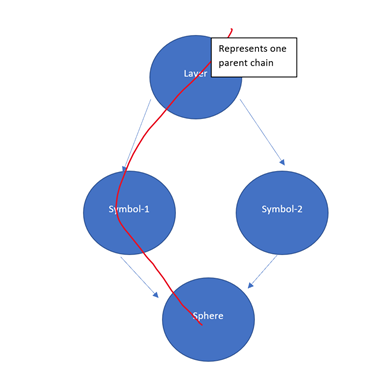
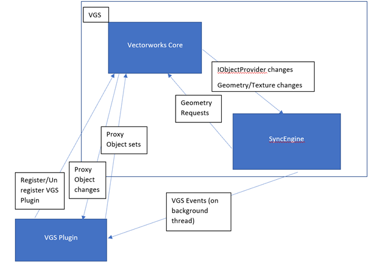

By [Andrew Gorbaty](mailto:agorbaty@nemetschek.net)

# Overview

VGS (Vectorworks Graphics Sync) is a system which propagates Vectorworks scene changes to clients that are currently listening to said changes. VGS can be used either as a mechanism for syncing to a listening app or as a file export.

> **NOTE:** Before consuming this article, make sure you are:
> - An experienced C++ developer
> - Familiar enough with the [Vectorworks C++ Plugin System](Plug-in%20Module.md)
> - Familiar with the [Vectorworks object list/tree](The%20Vectorworks%20Environment.md) (called “Vectorworks object tree” in this document)

# Concepts

Some concepts should be understood before using the VGS API:

**Parent Chain:**  
This represents one path to a child-most object in the Vectorworks object tree. By passing a number of these, a client can understand the entire Vectorworks object tree.  

**Proxy Objects:**  
The concept of Proxy Object is essentially a way of connecting the geometry-based objects to the objects within the Vectorworks object tree. There are two different systems for Proxy Objects:
- **Substitution:** Substitute one chain for another object entirely. This way the parent chain won’t be fed back to the client again. This is helpful if you wish to substitute specific objects in the Vectorworks object tree. For example, we could substitute a tree plugin object and all of its children with your own geometry.
- **Returning Parent Chains:** Always feed back the parent chains, regardless of what we substitute. This is probably the most effective way of obtaining the entire Vectorworks object tree all at the same time.

**SyncEngine:**  
The SyncEngine is an implementation of the VGM (Vectorworks Graphics Module, our in-house renderer) which is designed only to deal with changes within the Vectorworks scene. This includes handling object adds, modifies, deletes, and supporting features like various types of materials, lights, clip cubes, and more.

# Design

The design of VGS comes in three parts:

1. The core of Vectorworks which forwards the objects to the SyncEngine
2. The SyncEngine (a version of the VGM) which manages the incoming changes from the core (internal developers only)
3. The client plugin which listens for incoming changes from the SyncEngine on a thread that is not the main thread (for all developers)

Below is a diagram showing the general design of VGS. This article particularly focuses on using/modifying the VGS plugin.  

# Getting Started

First, download the VGSSample plugin from [VGSSample.zip](images/VGSSample.zip).

VGS plugins are initialized via calling `RegisterN` and shut down by calling `Unregister`.  
There are two required parameters to the `RegisterN` call:
- `inRenderEngineID` – the name of the VGS Plugin. If the name of the plugin is already registered, this function will return false.
- `inRenderPluginCallback` – the callback to client code for all VGS Events; these events should come through on a single lone background thread.

We also have these optional parameters:
- The scene ID, if not specified, the current pane ID will be used.
- Whether there’s a `proxyCallback` function or not, explained below.
- Whether there’s a `materialCallback` or not, this is primarily for material proxy callbacks.
- Whether we return all parent chains within the current scene, this is explained in the `proxyCallback` section.
- Whether we treat this register as a one-time sync, this treats the VGS like an export instead of a livesync that is constantly getting updated.

In the VGS Plugin, there are a various number of events propagated to clients. The VGS listener begins with an `Event_ListenerSetup` event, which can set output parameters in `listenerSetupArgs`. Please see `struct ListenerSetupArgs` for more information. Every event in VGS begins with an `Event_ChangeBlockBegin` and ends with an `Event_ChangeBlockEnd` event. Upon receiving `Event_ChangeBlockEnd`, the plugin should either send a response describing the current event if it’s a livesync, or export to a file if it’s a file export.

Most of the VGS events are self-explanatory, but there are a couple of notes to make for more confusing concepts:
- `materialIDs` within `struct ObjectModifyMaterialArgs` represents a vector of materials with multiple decals. `materialIDs[0]` represents the first material, whereas `materialIDs[0][0]` represents the base material of the first material. If decals are present, `materialIDs[0]` will have a size larger than 1.
- If proxy objects are set, `ObjectAddArgs` should have a `proxyID` that is non-zero. If proxy materials are set, `MaterialAddArgs` should have a `proxyID` that is non-zero. This is the system used for associating an object located in the Vectorworks object tree to a tessellation within VGS.

When you build/run Vectorworks from this plugin on either Mac or Windows, you will now see a “VGS Plugin” menu command within the list of menus when running `Tools --> Workspaces --> Edit Workspace`. Drag this menu command into your workspace and execute the command for a loaded Vectorworks file.

You should see output like this which shows all events in the queue.  

For updated events, you can see additional events come up in the output window. For example, if you move the camera, the events should appear as such:  

