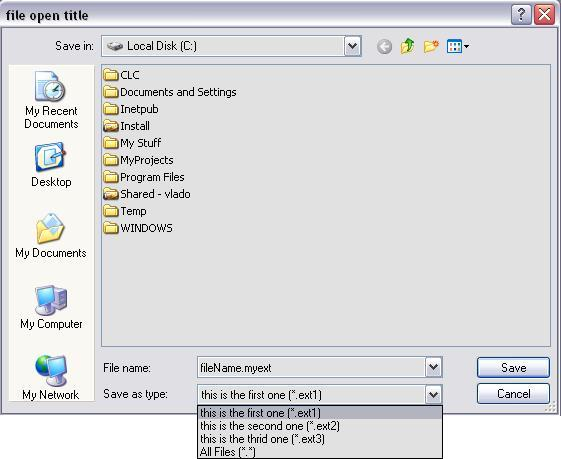
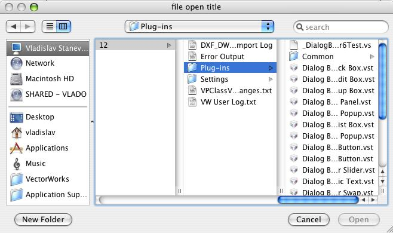
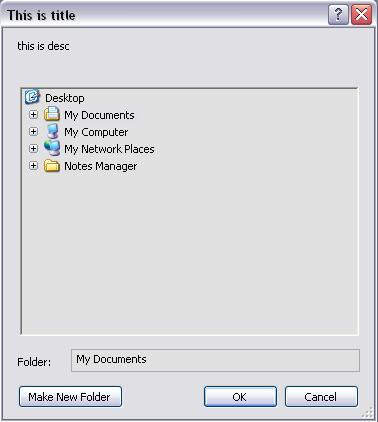
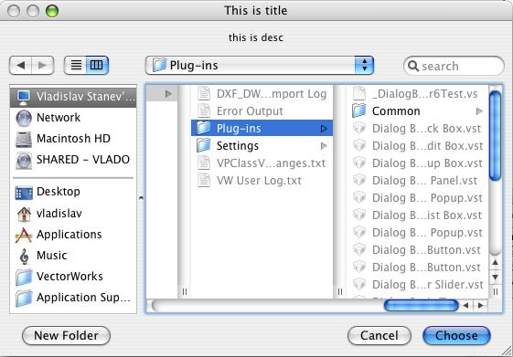

# File Choose Dialog

The interface `IFileChooserDialog` allows you to specify a filter for the shown files. The filter is composed of a list of file extensions.

- On Windows, this list is shown as different filter entries.
- On macOS, the filter's file extensions are combined into one list that is used to enable files with those extensions. If the list contains "Show All," then all files are shown on macOS regardless of the other extensions in the filter list.

  


```cpp
IFileChooserDialogPtr	pFileChooser( IID_FileChooserDialog );
if ( pFileChooser == NULL ) 
   return;

pFileChooser->SetTitle( "file open title" );
pFileChooser->SetDefaultFileName( "fileName" );
pFileChooser->AddFilter( "ext1", "this is the first one" );
pFileChooser->AddFilter( "ext2", "this is the second one" );
pFileChooser->AddFilter( "ext3", "this is the third one" );
pFileChooser->AddFilterAllFiles();
if ( VCOM_SUCCEEDED( pFileChooser->RunOpenDialog() ) ) {
   IFileIdentifierPtr	pFileID;

   if ( VCOM_SUCCEEDED( pFileChooser->GetSelectedFileName( 0, & pFileID ) ) {
       // ...
   }
}
```

# Folder Choose Dialog

The interface `IFolderChooserDialog` allows you to ask the user to choose a folder. The OS folder chooser dialog is shown to do that.

  


```cpp
VCOMPtr< IFolderChooserDialog >	pFolderDlg( IID_FolderChooserDialog );

vcomErr	= pFolderDlg->SetTitle( "This is title" );
vcomErr	= pFolderDlg->SetDescription( "this is desc" );

if ( VCOM_SUCCEEDED( pFolderDlg->RunDialog() ) ) {
    VCOMPtr<IFolderIdentifier>	pFolderID;
    vcomErr	= pFolderDlg->GetSelectedPath( & pFolderID );

    // ...
}
```
