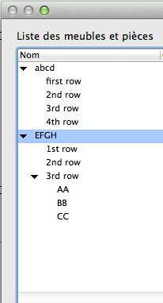
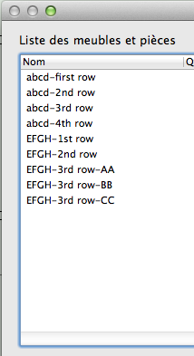

# Working with Hierarchical VWListBrowserCtrl

## Introduction

Since Vectorworks 2013, it is possible to create hierarchical list browsers, i.e., with rows that can be expanded to reveal other rows, recursively.

## Set up: Example



We will try in this article to get the result shown above.

### Basic Concept: The '-' Character

The first thing to understand with hierarchical list browsers is that you don't insert every row shown in the result. In our example, the inserted rows in the list browser are:

```cpp
abcd-first row
abcd-2nd row
abcd-3rd row
abcd-4th row
EFGH-1st row
EFGH-2nd row
EFGH-3rd row-AA
EFGH-3rd row-BB
EFGH-3rd row-CC
```

This is exactly the way the class list browser works in the Organization dialog.

### How to Activate the Hierarchical Mode

```cpp
// activating hierarchical mode
gSDK->EnableListBrowserHierarchicalDisplay( GetDialogID(), GetControlID(), true );

// telling LB which column is the one with collapse/expand arrow picture
gSDK->SetListBrowserHierarchicalDisplayColumn( GetDialogID(), GetControlID(), kFirstColumnIndex );

// we need to put these attributes. It doesn't work without them
gSDK->SetListBrowserItemDisplayType( GetDialogID(), GetControlID(), kFirstColumnIndex, kListBrowserDisplayImageAndText );
gSDK->SetListBrowserEditDisplayType( GetDialogID(), GetControlID(), kFirstColumnIndex, kListBrowserDisplayImageAndText );
gSDK->SetListBrowserControlType( GetDialogID(), GetControlID(), kFirstColumnIndex, kListBrowserControlDiscTriangle);
```

### Adding Rows

```cpp
size_t row = AddRow( "" );
GetItem( row, kFirstColumnIndex ).SetItemText( "abcd-first row" );
row = AddRow( "" );
GetItem( row, kFirstColumnIndex ).SetItemText( "abcd-2nd row" );
row = AddRow( "" );
GetItem( row, kFirstColumnIndex ).SetItemText( "abcd-3rd row" );
row = AddRow( "" );
GetItem( row, kFirstColumnIndex ).SetItemText( "abcd-4th row" );
row = AddRow( "" );
GetItem( row, kFirstColumnIndex ).SetItemText( "EFGH-1st row" );
row = AddRow( "" );
GetItem( row, kFirstColumnIndex ).SetItemText( "EFGH-2nd row" );
row = AddRow( "" );
GetItem( row, kFirstColumnIndex ).SetItemText( "EFGH-3rd row-AA" );
row = AddRow( "" );
GetItem( row, kFirstColumnIndex ).SetItemText( "EFGH-3rd row-BB" );
row = AddRow( "" );
GetItem( row, kFirstColumnIndex ).SetItemText( "EFGH-3rd row-CC" );
```

### The Missing Mystery Part

Once we've done all this, the list browser looks like this:



Not very hierarchical, is it? It's because one of the calls we've done before the row inserts has to be made **after**. So we just need to do this:

```cpp
// activating hierarchical mode (again!)
gSDK->EnableListBrowserHierarchicalDisplay( GetDialogID(), GetControlID(), true );
```

## Dealing with Events

When the user clicks on the expand/collapse arrow, they expect to expand or collapse the tree below the clicked row. We have to deal with this.

```cpp
size_t		row, col;
EListBrowserEventType type = eventArgs.GetListBrowserEvent(row, col);

if(type == kListBrowserEventType_DataChangeClick)     // arrow click
{
	if(gSDK->HierarchicalListBrowserItemIsClosed( GetDialogID(), Di_LP_ListItem, row ))
	{				
		gSDK->HierarchicalListBrowserItemOpened( GetDialogID(), Di_LP_ListItem, row, false, processedItemsCnt);
	}
	else
	{
		gSDK->GetDisplayedItemsCountInHierarchicalContainer( GetDialogID(), Di_LP_ListItem, row, processedItemsCnt);
		gSDK->HierarchicalListBrowserItemClosed( GetDialogID(), Di_LP_ListItem, row, false );
	}
}
```

**Important**

When the user closes a row, the list browser loses all the data attached to hidden rows except the text of the hierarchical column. All the other columns, styles, item data, etc., are lost. We have to restore all these when the user opens back the row.

**Vectorworks 2019:** It looks like the above is not true anymore as the ListBrowser restores the content automatically.

It is useful to know that getting a cell content will return a partial string, as it appears on the ListBrowser. To get the full row string, including the parent folders and delimiter, use:

```cpp
TXString cellTxt = VWListBrowserCtrl::GetItemOriginalName( row, true );
```

## VWFC Example

Here is a full VWFC example. It shows a hierarchical ListBrowser control containing a set of services, ordered in folders. It is used in a dialog that asks the user to select a service:

```cpp
void CDlgSelService::OnInitializeContent()
{
    VWDialog::OnInitializeContent();

    this->FillServersPopup();
    
    VWListBrowserCtrl* servicesLB = this->GetListBrowserCtrlByID( kServiceLB );
    servicesLB->EnableHierarchicalDisplay( true );
    VWListBrowserColumn nameCol = servicesLB->AddColumn( kStr_ColName_ServiceName, "kStr_ColName_ServiceName", 280 );
    nameCol.SetAsHierarchicalDisplayColumn();
    nameCol.SetEditDisplayType( kListBrowserDisplayImageAndText );
	nameCol.SetItemDisplayType( kListBrowserDisplayImageAndText );
    nameCol.SetColumnType( kListBrowserControlDiscTriangle );
    
    this->FillServices();
    
    // ...
}

void CDlgSelService::FillServices()
{
    VWListBrowserCtrl* servicesLB = this->GetListBrowserCtrlByID( kServiceLB );
    servicesLB->DeleteAllRows();
    
    const auto& serversList = Data::CServersList::Instance();
    const auto& arrServers = serversList.GetServers();
    fWebContext.SetServerURL( fServerPopup < arrServers.size() ? arrServers[fServerPopup].fURL : serversList.GetDefaultURL() );
    
    TXStringSTLArray    arrServices;
    fListServices.ListServices( arrServices );
    
    std::sort( arrServices.begin(), arrServices.end(), [](const TXString& a, const TXString& b) { return a < b; } );
    
    size_t selService = size_t(-1);
    for(const auto& service : arrServices)
    {
        TXString line = service;
        line.Replace( "/", "-" );
        size_t rowIndex = servicesLB->AddRow( line );
        
        if ( service == fSelectedService )
            selService = rowIndex;
    }
    
    servicesLB->EnableHierarchicalDisplay( true );
    if ( selService != size_t(-1) )
        servicesLB->SelectRow( selService, true );
}

void CDlgSelService::OnServiceLB(TControlID controlID, VWDialogEventArgs& eventArgs)
{
    VWListBrowserCtrl* servicesLB = this->GetListBrowserCtrlByID( kServiceLB );
    
    size_t        row, col;
    EListBrowserEventType type = eventArgs.GetListBrowserEvent( row, col );
    
    if ( col == 0 && type == kListBrowserEventType_DataChangeClick )     // arrow click
    {
        size_t processedItemsCnt = 0;
        bool doExpand = servicesLB->IsRowClosed( row );
        if ( doExpand )
            servicesLB->ExpandItems( row, false, processedItemsCnt );
        else
            servicesLB->CloseItems( row, false, processedItemsCnt );
    }
    else if ( type == kListBrowserEventType_SelectionChangeClick || type == kListBrowserEventType_DoubleClick )
    {
        VWListBrowserCtrl* servicesLB = this->GetListBrowserCtrlByID( kServiceLB );
        size_t selServiceIndex = servicesLB->GetFirstSelected();
        
        fSelectedService.Clear();
        if ( selServiceIndex != size_t(-1) )
        {
            fSelectedService = servicesLB->GetItemOriginalName( selServiceIndex, true );
            fSelectedService.Replace( "-", "/" );
        }

        this->FillParameters();

        if ( type == kListBrowserEventType_DoubleClick )
            VWDialog::SetDialogClose( true );
    }
}
```

## See Also

[SDK: Working with VWListBrowserCtrl](Working%20with%20VWListBrowserCtrl)
