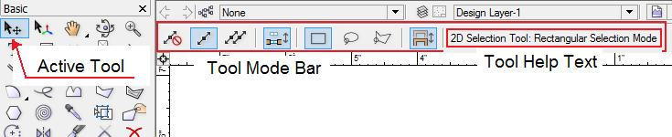
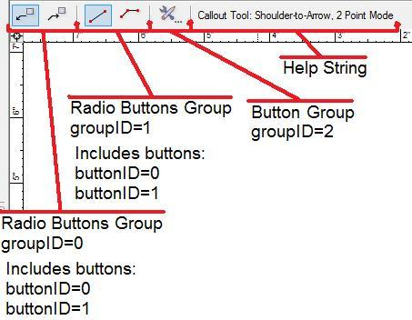

# Mode Bar

The mode bar is the space on top of the document where VectorWorks shows tool-specific User Interface widgets as well as a line of help text.



VectorWorks sends several events to allow the plug-in to define the Mode Bar and to respond to events from it:

- **kToolDoSetup** -- This event is sent when the tool is activated or the tool is resumed. During this event, the plug-in must set up the mode bar.
- **kToolDoSetDown** -- This event is sent when the tool is deactivated or suspended. During this event, the plug-in must store the mode bar state so it can be restored if needed.
- **kToolDoModeEvent** -- The user has selected a User Interface element from the Mode Bar.

## kToolDoSetup

During this **kToolDoSetup** event, the user has to create the mode bar using the following functions:

- `ISDK::AddButtonMode`
- `ISDK::AddCheckMode`
- `ISDK::AddPullDownMenuMode`
- `ISDK::AddRadioMode`
- `ISDK::AddTxtBtnMode`

And then initialize the initial state of the mode bar.

Usually, the plug-in stores the state on **kToolDoSetDown** and restores it using **kToolDoSetup**.

- `ISDK::EnableMode`
- `ISDK::SetModeValue`
- `ISDK::AddPullDownMenuItem`
- `ISDK::SetPullDownMenuSelection`

## kToolDoSetDown

Usually, the plug-in stores the state on **kToolDoSetDown** and restores it using **kToolDoSetup**.

- `ISDK::GetModeValue`

## kToolDoModeEvent

This message is received when a Mode Bar User Interface element is selected by the user.

The messages are as follows:

```cpp
size_t groupID     = message1 > 0 ? (size_t)(message1-1) : 0;
size_t buttonID    = message2 > 0 ? (size_t)(message2-1) : 0;
size_t newButtonID = buttonID & 0x0000FFFF;
size_t oldButtonID = (buttonID & 0xFFFF0000) >> 24;
```

The User Interface groups are represented by an ID, which is the index of the element. Every group contains one element, except radio groups, which have many elements in the group.

The radio groups contain elements with consecutive indexes.

- `ISDK::EnableMode`
- `ISDK::SetHelpString`


