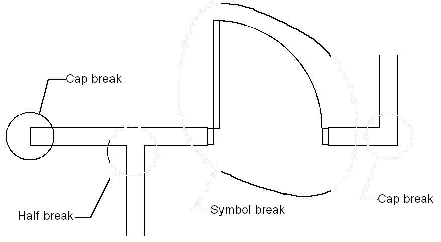

By [Vladislav Stanev](mailto:vstanev@nemetschek.net)

## Wall

Walls are defined as a line segment with a variable number of “nodes,” called breaks, that lie along its length. The controlling line, accessed with **ISDK::GetEndPoints**, specifies the center line of the wall. The width of the wall **ISDK::WrapGetWallWidth**, indicates how far on each side of the center line to create the outer edge of the wall. For 3D drawing, heights of the start and end of the wall **ISDK::GetWallHeights** can be independently set.

## Wall Breaks

Breaks are modifications to the wall.

The following functions are defined for working with breaks:
- **ISDK::AddBreak** - add a new break to an existing wall.
- **ISDK::SetBreak** - updates break information.
- **ISDK::DeleteBreak** - removes a break from an existing wall.
- **ISDK::ForEachBreak** - enumerates breaks of an existing wall.

An offset from the start point of the wall specifies their location.

Their type can be one of the following:

```cpp
// filepath: d:\Engineering\developer-sdk\Info\Working with Wall Breaks.md
const short kSymbolBreak    = 1;
const short kHalfBreak      = 2;
const short kPeakBreak      = 3;
const short kCapBreak       = 4;
```



### Cap Break

A Cap break specifies modifications to an end of the wall. A wall may have 0, 1, or 2 caps. The offset of a cap break should be `-1` if it is the start cap and `LONG_MAX` (defined in `limits.h`) if it is the end cap. A cap specifies whether the end of the wall is closed and if it is closed whether it is rounded. Since the position of the wall is specified by the center line, the cap also specifies any offset of the endpoint of either side line from the corresponding endpoint of the center line (to create a “tilted cap”). VectorWorks ignores cap end offsets with round caps.

### Half Break

A half break is a gap in a side of a wall visible in plan view. These occur where one wall joins another. A half break defines a starting position for the gap and a gap length.

### Peak Break

A peak break is a 3D-only break that specifies the height of the wall at a given offset.

### Symbol Break

A symbol break specifies the insertion of an instance of a symbol or plug-in object into a wall. The symbol cuts the wall as necessary. A symbol break defines the symbol definition of the inserted symbol, the height of the symbol’s insertion point in the wall, and the orientation of the symbol (towards which quadrant of the wall is the symbol directed).

## Enumerating Breaks

```cpp
// filepath: d:\Engineering\developer-sdk\Info\Working with Wall Breaks.md
static Boolean EnumerateBreaksCallback(MCObjectHandle h,
                                       long           index,
                                       WorldCoord     off,
                                       long           breakType,
                                       void*          pBreakData,
                                       CallBackPtr    cbp,
                                       void*          pMyEnv)
{
  // NOTE! pBreakData points to local variable
  //       Changing it will not apply the changes unless you call 'gSDK->SetBreak'
  if ( breakType == kCapBreak ) {
    CapBreakType*   pCapBreak  = (CapBreakType*) pBreakData;

    // ...
  }
  else if ( breakType == kHalfBreak ) {
    HalfBreakType*   pHalfBreak  = (HalfBreakType*) pBreakData;

    // ...
  }
  else if ( breakType == kPeakBreak ) {
    PeakBreakType*   pPeakBreak  = (PeakBreakType*) pBreakData;

    // ...
  }
  else if ( breakType == kSymbolBreak ) {
    SymbolBreakType* pSymbolBreak  = (SymbolBreakType*) pBreakData;

    // ...
  }

  // return 'false' if the enumeration has to continue
  // return 'true' if the enumeration has to stop
  return false;
}

void fun()
{
  gSDK->ForEachBreak( hWall, EnumerateBreaksCallback, NULL );
}
```

## See also

[Working with Wall Breaks - Cap](Working%20with%20Wall%20Breaks%20-%20Cap.md) | [Working with Wall Breaks - Half](Working%20with%20Wall%20Breaks%20-%20Half.md) | [Working with Wall Breaks - Peak](Working%20with%20Wall%20Breaks%20-%20Peak.md) | [Working with Wall Breaks - Symbol](Working%20with%20Wall%20Breaks%20-%20Symbol.md)
