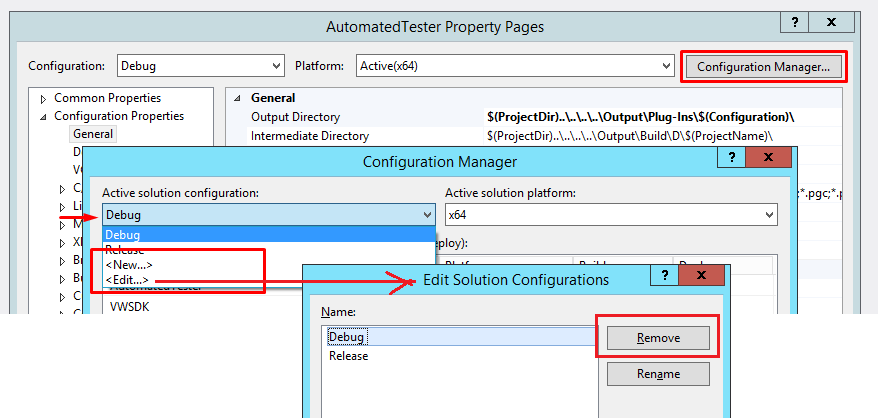
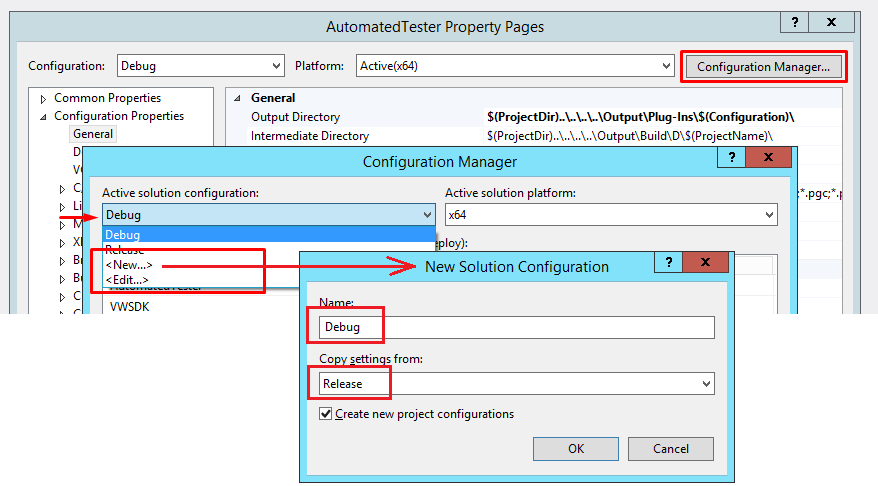
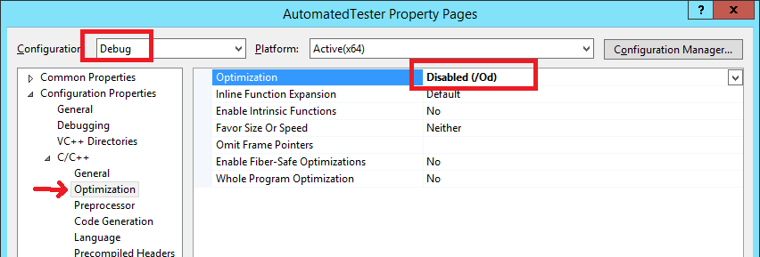
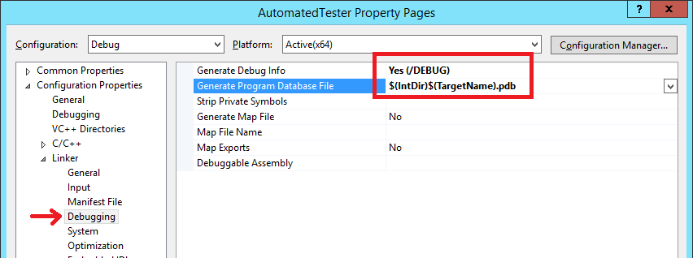
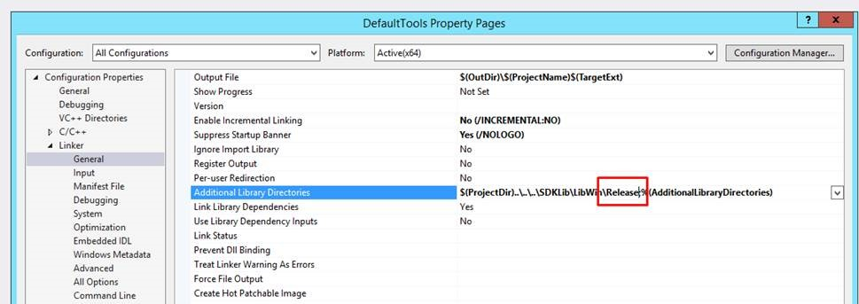

## General Info

The Vectorworks 2018 SDK requires Visual Studio 2012 on Windows and Xcode version 8.2 on the Mac.

Vectorworks 2018 has been converted to Unicode using UTF-16 internally. The SDK's TXString class has been converted.

## Function Changes

[Unicode details](../Info/Vectorworks%202018%20Unicode.md)

## Debugging

After the Unicode conversion, there are some issues (crashing) with the debugging SDK plugins with Vectorworks.  

### The Problem

After the Unicode conversion (Vectorworks 2018), there are some issues (crashing) with the debugging SDK plugins with Vectorworks.  
Unicode details at [Vectorworks 2018 Unicode](../Info/Vectorworks%202018%20Unicode.md)

**This is Windows ONLY problem!**

The problem is the fact that the SDK uses STL for the [TXString](../Info/Type%20TXString.md) representation.

On Windows, the STL is compiled differently between Debug and Release configurations. So, when a plugin is compiled in Debug configuration, it cannot run with the Release Vectorworks. In fact, it will cause Vectorworks to **crash!**

### The Solution

The solution is to change the Debug configuration so it would build like-release, but still support debugging so the plugin code can be stepped through and variables monitored.

**Again, this is Windows ONLY problem with VisualStudio**

There are three steps in fixing this for your projects:

#### Delete Debug Config

The existing Debug configuration is not needed. You should delete it in the Configuration Manager.

1. Right click on your project and select properties.  
2. Then click on the 'Configuration Manager...' button.  
3. In the active solution configurations popup, select '<Edit>'.  
4. In the new dialog, you can select Debug and hit the 'Remove Button'.

#### Create a new Debug Config

Create a new Debug configuration that is based on the Release configuration.

1. Right click on your project and select properties.  
2. Then click on the 'Configuration Manager...' button.  
3. In the active solution configurations popup, select '<New>'.  
4. Enter 'Debug' as name.  
5. And choose 'Release' to copy the settings from.

#### Setup the new Debug Config

Edit the Debug configuration to make it debug-like as it is based on Release because of the way we created it.

1. Right click on your project and select properties.  
2. Make sure the Debug configuration is selected.  
3. Disable Optimization in **C/C++ -> Optimizations** pane.  
4. Enable **Generate Debug Info** and the **Generate Program Database File** in **Linker -> Debugging** pane.

#### Ensure Release Library Use

Make sure that the Debug project uses the Release SDK. For example, the Additional Library Directories would use the configuration name, which will lead to Debug lib files being used. So, make sure you update it to explicitly look them in the 'Release' folder:

### Conclusion

The new Debug configuration is based on Release, which will make VisualStudio use the same STL as the release distribution of Vectorworks.

The PDB (Program Database) file will be used by VisualStudio when debugging the plugin. This file contains information how the binary code relates to the source code and allows the debugger to step through the source text files.  
*Info:* The source files are not part of the PDB file. You have to have them on the machine where the PDB is used.

Lastly, we've turned off the optimizations as this will make the debugging easier. Without this, the binary code will not match the source code perfectly as the compiler will optimize the calls and the usage of memory. This will make debugging possible but strange, as the execution will jump from place to place and variables will not always have correct values.

