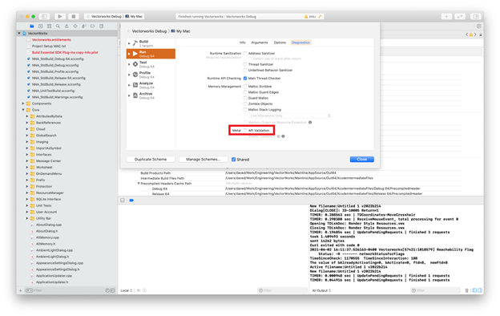

# General Info

The Vectorworks 2022 SDK requires:
- **Windows**: Visual Studio 2017 version 15.3.7 (toolset v141)  
- **Mac**: Xcode version 12.4

Before debugging Vectorworks on the Mac, please make sure to turn off Metal API Validation. This option can be turned off by going to **Edit Scheme** → **Diagnostics** → **API Validation**.  

# Examples

[SDK Examples Repository](https://github.com/VectorworksDeveloper/SDKExamples)
