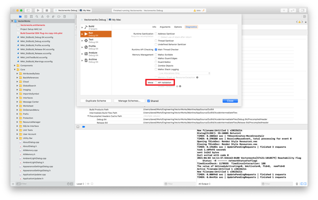

## General Info

The Vectorworks 2023 SDK requires:
- **Win**: Visual Studio 2017 version 15.3.7 (toolset v141) 
- **Mac**: Xcode version 13.1

Before debugging Vectorworks on the Mac, please make sure to turn off Metal API Validation. This option can be turned off by going to **Edit Scheme** → **Diagnostics** → **API Validation**.

## Examples

[SDK Examples on GitHub](https://github.com/VectorworksDeveloper/SDKExamples)
